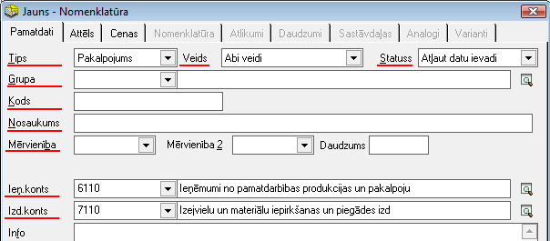

.. 108
 
Pakalpojumi
***************
 
Pakalpojumu sarakstā tiek saglabāti biežāk izmantojamie Pakalpojumu
apraksti, ērtākai norēķinu dokumentu ievadei. Pakalpojuma apraksts ir
informācija, kas ir kopīga visiem vienādiem saņemtajiem vai
sniegtajiem pakalpojumiem. Pakalpojuma apraksts satur informāciju par
Grupu, nosaukumu, kodu, mērvienību un grāmatvedisko kontu.

Pakalpojumi var tikt uzskaitīti pa Noliktavām un grupēti, izmantojot
:doc:`Grupu<148>` sarakstu.

Lai pievienotu jaunu Pakalpojumu, rīku joslā jānospiež poga
|images_ozols/24708.png| un tiks atvērts jauns logs, kur jāaizpilda
nepieciešamie lauki:

|images_ozols/26434.png|
**
Tips: **pazīme, kas norāda, ka tas ir Pakalpojums;
**Veids:** iespēja norādīt pakalpojuma veidu - vai tas būs sniegtais
pakalpojums, saņemtais vai abu veidu pakalpojums (var būt gan kā
sniegtais, gan saņemtais);
**Statuss: **iespēja norādīt, vai šim Pakalpojumam būs atļauta vai
aizliegta datu ievade (Vai pakalpojumu varēs ievadīt norēķinu
dokumenta saturā);
**Grupa:** jānorāda grupa, kurā šis pakalpojums atradīsies;
**Kods:** pakalpojuma saīsināts nosaukums;
**Nosaukums:** pakalpojuma pilns nosaukums;
**Mērvienība: **pakalpojuma mērvienība;
**Ieņ.konts:** pakalpojuma grāmatvediskais ieņēmuma konts, kas tiks
izmantots pārdošanas dokumenta grāmatošanā;
**Izd.konts: **pakalpojuma grāmatvediskais izdevumu konts, kas tiks
izmantots iepirkumu dokumenta grāmatošanā.

Pēc datu aizpildīšanas, Pakalpojuma aprakstu iespējams
|images_ozols/24615.jpg| vai |images_ozols/24617.jpg| .

.. |images_ozols/24708.png| image:: images_ozols/24708.png
       :scale: 100%

.. |images_ozols/24615.jpg| image:: images_ozols/24615.jpg
       :scale: 100%

.. |images_ozols/24617.jpg| image:: images_ozols/24617.jpg
       :scale: 100%


 
