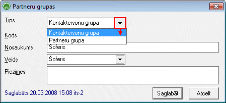
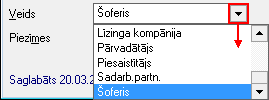

.. 113
 
Partneru grupas
*******************
 

Sarakstā tiek saglabātas Partneru grupas, kurastiek lietotas
pievienojot :doc:`Partneri<312>` un :doc:`Partnera
kontaktpersonu<389>` .

Partneru grupas tiek pievienotas, lai būtu iespējams partnerus
sagrupēt pa dažādiem Partneru veidiem (šoferis, apgādājamais, ģimenes
loceklis, pārvadātājs, u.c.).

Lai pievienotu jaunu partneru grupu sarakstam, rīku joslā jānospiež
poga .. image:: images_ozols/25605.png
:scale: 100%
:

:scale: 100%

Tips: tiek norādīta kontaktpersonu vai partneru grupa (pie kādas
grupas būs pievienotais partnera veids);

Kods: nosaukuma saīsinājums vai veida apzīmējums;

Nosaukums: pilns nosaukums;

Veids: jāizvēlas attiecigais partnera veids:

:scale: 100%

Lai saglabātu partnera grupu, jānospiež poga .. image::
images_ozols/25621.png
:scale: 100%
.


 
