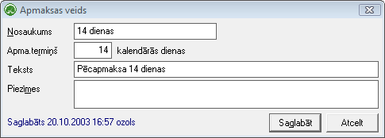

.. 122
 
Apmaksas veidi
******************
 
Sarakstā tiek saglabāti apmaksu veidi, kas tiek izmantoti
:doc:`norēķinu dokumentu<304>` aizpildīšanai.


Jauna apmaksas veida pievienošana
`````````````````````````````````

Lai pievienotu jaunu apmaksas veidu jāizmanto komanda
|images_ozols/24708.png| no rīku joslas un tiks atvērts jauns logs,
kur visi aizpildīšanas lauki būs tukši.


Piemērs: "apmaksas veids - 14 dienas"


|images_ozols/26118.png|


Laukā "Apm. termiņš" jāraksta tik dienu skaits, cik dienas būs kā
apmaksas termiņš pārdošanas un iepirkuma dokumentos.


Jaunpievienotais ieraksts tiks saglabāts, izpildot komandu
|images_ozols/24710.png|


Pievienotā apmaksas veida labošana
``````````````````````````````````

Lai veiktu labojumus pievienotajā ierakstā, ierakstu nepieciešams
atvērt, izmantojot rīku joslas pogu |images_ozols/24709.png| (ALT+A).
Atvērtajā logā var mainīt jebkuru informāciju pēc nepieciešamības. Pēc
labojumu veikšanas, veiktās izmaņas iespējams saglabāt ar komandu
|images_ozols/24710.png| vai atcelt ar komandu
|images_ozols/24617.jpg|


Pievienotā apmaksas veida dzēšana
`````````````````````````````````

Lai dzēstu apmaksas veida ierakstu, tas ir jāiezīmē ar kursoru.
Ieraksts nav jāatver. Izmantojot komandu |images_ozols/24719.JPG| no
rīku joslas (ALT+Z) jādzēš ieraksts.

.. |images_ozols/24708.png| image:: images_ozols/24708.png
       :scale: 100%



.. |images_ozols/24710.png| image:: images_ozols/24710.png
       :scale: 100%

.. |images_ozols/24709.png| image:: images_ozols/24709.png
       :scale: 100%

.. |images_ozols/24710.png| image:: images_ozols/24710.png
       :scale: 100%

.. |images_ozols/24617.jpg| image:: images_ozols/24617.jpg
       :scale: 100%

.. |images_ozols/24719.JPG| image:: images_ozols/24719.JPG
       :scale: 100%


 
