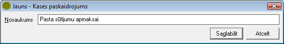

.. 136
 
Kases paskaidrojumu saraksts
********************************
 

Kases paskaidrojumu sarakstā tiek saglabāti biežāk izmantotie kases
izdevumu un ieņēmumu pamatojumi. Paskaidrojumi tiek izmantoti kases
dokumentu lauka Pamatojums aizpildīšanai.

JaunaKases paskaidrojumu sarakstapievienošana:
++++++++++++++++++++++++++++++++++++++++++++++

Lai pievienotu jaunuKases paskaidrojumu sarakstu,jānospiež poga
|images_ozols/24708.png| un tiks atvērts jauns logs:

|images_ozols/24659.jpg|

Laukā Nosaukums, nepieciešams ierakstītKases paskaidrojuma nosaukumu.
Ieraksts tiks saglabāts, izpildot komandu |images_ozols/24615.jpg| .

PievienotāKasespaskaidrojumu sarakstalabošana:
++++++++++++++++++++++++++++++++++++++++++++++

Lai veiktu labojumus pievienotajā ierakstā, ierakstu nepieciešams
atvērt, izmantojot rīku joslas pogu |images_ozols/24709.png| (ALT+A),
unatvērtajā logā nomainīt Nosaukumu.

Pēc labojumu veikšanas, veiktā izmaiņas iespējams
|images_ozols/24615.jpg| vai |images_ozols/24617.jpg| .

.. |images_ozols/24708.png| image:: images_ozols/24708.png
       :scale: 100%

.. |images_ozols/24615.jpg| image:: images_ozols/24615.jpg
       :scale: 100%

.. |images_ozols/24709.png| image:: images_ozols/24709.png
       :scale: 100%

.. |images_ozols/24615.jpg| image:: images_ozols/24615.jpg
       :scale: 100%

.. |images_ozols/24617.jpg| image:: images_ozols/24617.jpg
       :scale: 100%


 
