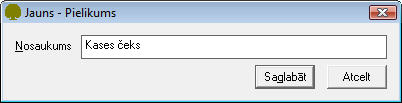

.. 137
 
Kases pielikumu saraksts
****************************
 

Kases pielikumu sarakstā tiek glabāti dokumentu veidu nosaukumi, kas
visbiežāk pamato naudas kustību, piemēram čeks, kvīts un tmldz.

JaunaKases pielikumasarakstapievienošana:
+++++++++++++++++++++++++++++++++++++++++

Lai pievienotu jaunuKases pielikumusarakstu,rīku joslā jānospiež poga
|images_ozols/24708.png| un tiks atvērts jauns logs:

|images_ozols/24660.jpg|

Laukā Nosaukums, nepieciešams ierakstīt Kases pielikuma nosaukumu.
Ieraksts tiks saglabāts, izpildot komandu |images_ozols/24615.jpg| .

Pievienotā Kases pielikumu sarakstalabošana:
++++++++++++++++++++++++++++++++++++++++++++

Lai veiktu labojumus pievienotajā ierakstā, ierakstu nepieciešams
atvērt, izmantojot rīku joslas pogu |images_ozols/24709.png| (ALT+A),
unatvērtajā logā nomainīt Nosaukumu.

Pēc labojumu veikšanas, veiktā izmaiņas iespējams
|images_ozols/24615.jpg| vai |images_ozols/24617.jpg| .

.. |images_ozols/24708.png| image:: images_ozols/24708.png
       :scale: 100%

.. |images_ozols/24615.jpg| image:: images_ozols/24615.jpg
       :scale: 100%

.. |images_ozols/24709.png| image:: images_ozols/24709.png
       :scale: 100%

.. |images_ozols/24615.jpg| image:: images_ozols/24615.jpg
       :scale: 100%

.. |images_ozols/24617.jpg| image:: images_ozols/24617.jpg
       :scale: 100%


 
