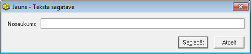

.. 140
 
Teksta sagataves
********************
 


Sarakstā tiek saglabāti teksta sagataves - paskaidrojumu teksti, kas
tiek izmantoti :doc:`Iepirkuma<310>` un :doc:`Pārdošanas<304>`
dokumentu Virsrakstā esošā Paskaidrojuma lauka aizpildīšanai.


Jaunateksta sagataves-paskaidrojuma tekstapievienošana
``````````````````````````````````````````````````````

Lai pievienotu jaunupaskaidrojuma tekstu, jāizmanto komanda
|images_ozols/24879.png| no rīku joslas (Alt+P) un tiks atvērts jauns
logs:


|images_ozols/26497.png|


Laukā "Nosaukums" jāraksta jaunizveidotā paskaidrojuma teksts.


Jaunizveidotais ieraksts tiks saglabāts, izmantojot komandu
|images_ozols/24867.png| no rīku joslas vai (Ctrl+S) vai atcelts , ja
tiks izmantota komanda |images_ozols/24617.jpg| .


Paskaidrojuma teksta labošana
`````````````````````````````

Lai veiktu labojumus paskaidrojuma tekstā, ierakstu nepieciešams
atvērt, izmantojot komandu |images_ozols/24869.png| no rīku joslas
(Alt+A). Atvērtajā logā iespējams mainīt nosaukumu. Pēc labojumu
veikšanas, veiktās izmaiņas iespējams saglabāt ar komandu
|images_ozols/24867.png| no rīku joslas.


Paskaidrojuma tekstadzēšana
```````````````````````````

Lai dzēstu paskaidrojuma tekstu, jāizmanto komanda
|images_ozols/25602.png| no rīku joslas. Ieraksts ir jādzēš neatvērtā
veidā.

.. |images_ozols/24879.png| image:: images_ozols/24879.png
       :scale: 100%



.. |images_ozols/24867.png| image:: images_ozols/24867.png
       :scale: 100%

.. |images_ozols/24617.jpg| image:: images_ozols/24617.jpg
       :scale: 100%

.. |images_ozols/24869.png| image:: images_ozols/24869.png
       :scale: 100%

.. |images_ozols/24867.png| image:: images_ozols/24867.png
       :scale: 100%

.. |images_ozols/25602.png| image:: images_ozols/25602.png
       :scale: 100%


 
