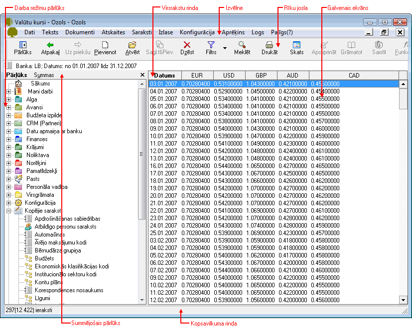
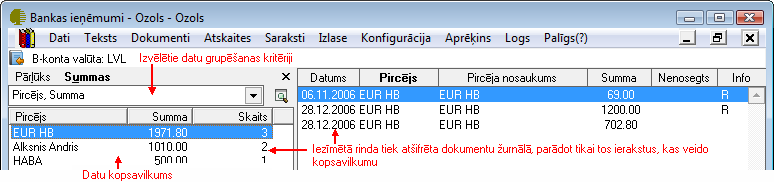
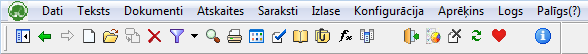

.. 14013
 
Darba režīmu izkārtojums un pieejamās komandas
**************************************************
 

Pārlūks
+++++++

Pārlūks tiek parādīts ekrāna kreisajā pusē un tiek izmantots pieejamo
darba režīmu parādīšanai. Darba režīmu izkārtojums ir līdzīgs galvenās
izvēlnes darba režīmu sakārtojumam.

|images_ozols/25280.png|

Pārlūkā darba režīmi tiek parādīti hierarhiski. Lai aktivizētu
nepieciešamo darbību, ar peli jāuzklikšķina uz ieraksta, lai atvērtu
zemākā līmeņa darba režīmus. Uzklikšķinot, piemēram, uz komandas Kases
ieņēmumu dokumenti, ekrāna labajā pusē tiek atvērts kases dokumentu
žurnāls. Lai atvērtu nākamo nepieciešamo darba režīmu, pārlūkā
jāuzklikšķina uz tā, un ekrāna labajā pusē tiks atvērts norādītais
darba režīms.

Pārlūku var noņemt un uzlikt, izmantojot rīku joslas komandas
|images_ozols/24630.gif| , |images_ozols/24631.gif| vai pogu X .

Ja pārlūks netiek noņemts, tas tiek parādīts uz ekrāna visu programmas
darbības laiku, strādājot ar dažādiem atvērtajiem darba režīmiem
ekrāna labajā pusē.

Summējošais pārlūks
+++++++++++++++++++

Darba režīmos ir iebūvētas iespējas izmantot summējošo pārlūku, lai uz
ekrāna iegūtu kopsavilkuma datus, atbilstoši izvēlētajiem grupēšanas
kritērijiem. Summējošo pārlūku iespējams izmantot dokumentu žurnālos,
atskaitēs.

|images_ozols/24545.gif| Summējošā pārlūka datu grupēšanas kritērijus
izveido un saglabā lietotājs.

Lai izmantotu summējošo pārlūku:

#. Jāatver darba režīms vai jāsagatavo atskaite.
#. Pārlūkā jāaktivizē komanda Summas.

|images_ozols/25281.png|

3.Jāizvēlas datu grupēšanas kritērijs. Ja datu grupēšanas kritēriju
nav, tie jāizveido:

|images_ozols/25282.png|

4.Lai izveidotu jaunu datu grupēšanas kritēriju, jāatver grupēšanas
kritēriju pievienošanas ekrāna forma, nospiežot pogu
|images_ozols/24635.gif| un izvēloties kritēriju, jālieto komanda
Pievienot, lai pievienotu jaunu grupēšanas kritēriju. Ekrāna formā
jāizvēlas kolonnas un ar komandas Pievienot palīdzību jāpārnes formas
labajā pusē. Lai grupēšanas kritērijs būtu pieejams visiem
lietotājiem, jāaktivizē komanda Kopīgs. Jāsaglabā izveidotais
grupēšanas kritērijs.

|images_ozols/25283.png|

Izvēloties grupēšanas kritēriju, pārlūkā tiek parādīti kopsavilkuma
dati no atvērtā darba režīma. Iezīmējot kopsavilkuma rindu pārlūkā,
ekrāna labajā pusē – dokumentu žurnālā vai atskaitē tiek parādīti
tikai tie dati, kuri veido šo kopsavilkuma rindu.

|images_ozols/25284.png|

Galvenā izvēlne
+++++++++++++++

Galvenajā izvēlnē ir pieejama visu programmā paredzēto darbību
aktivizēšana. Galvenā izvēlne ir pieejama visu datorprogrammas
darbības laiku. Galvenās izvēlnes lietošana ir līdzīga kā Windows
programmās.

Darba režīmi programmā ir sagrupēti zem izvēlnēm Dati, Teksts,
Dokumenti, Atskaites, Saraksti, Izlase, Konfigurācija, Logs, Palīgs.
Visus tos pašus darba režīmus var atrast arī izmantojot Pārlūku.

Biežāk lietotās galvenās izvēlnes komandas pieejamas arī no
datorprogrammas rīku joslas.

|images_ozols/25285.png|

Rīku josla
++++++++++

Rīku josla ir grafisks komandpogu izvietojums, kas ļauj ātrāk un
uzskatamāk veikt nepieciešamo darbību.

Ja peles kursoru nedaudz ilgāk patur uz kādas no rīku joslas ikonām,
parādās šīs pogas skaidrojums un taustiņu kombinācija, ar kuras
palīdzību var aktivizēt noteikto darbību.

Izšķir aktīvas un neaktīvas komandpogas rīku joslā. Neaktīvo ikonu
krāsa ir blāva, un to darbību konkrētajā ekrāna formā patreizējā brīdī
nevar aktivizēt.

Ja rīku josla nav redzama, to var uzlikt no izvēlnes lietojot komandu

>Konfigurācija > Rīku joslas > Komandas

Rīku joslu var konfigurēt, izmantojot galvenās izvēlnes komandu

>Konfigurācija > Iestādījumi > Individuālie > Rīku joslas pielāgošana

Rīku joslas komandas
++++++++++++++++++++

Komanda Funkcijas

Komanda funkcija |images_ozols/24642.gif| ir pieejam atsevišķiem darba
režīmiem un ar šīs komandas palīdzību var aktivizēt programmā
iebūvētas speciālas funkcijas. Komandu funkcijas var izsaukt arī
uzklikšķinot uz ieraksta ar labo peles pogu. Ja komanda Funkcijas ir
pelēka (nav aktīva), tas nozīmē, ka šim darba režīmam šāda komanda nav
paredzēta. Komandu |images_ozols/24642.gif| var izmantot:

Darba režīms
++++++++++++

Funkcija
++++++++
Rēķins Rēķina pārveidošanai par pavadzīmi Piedāvājums Piedāvājuma
pārveidošanai par rēķinu vai pavadzīmi Virsgrāmatas atskaitēs Citu
atskaišu izsaukšanai, konta apraksta izsaukšanai Bankas, Kases
žurnālos
Norēķinu, Pārdošanas žurnālos Dokumentu saistīšanai Bankas, Kases
žurnālos
Norēķinu, Pārdošanas žurnālos Atlasīto/Iezīmēto dokumentu grāmatošanai
Grāmatojumu žurnālā Pirmdokumentu atvēršanai Iepirkuma dokumentā
Iepirkuma dokumenta apstrādei Iepirkumu dokumentā Bankas maksājuma
uzdevuma automātiskai izveidei Iepirkumu dokumentā Norēķinu dzēšanas
akta izveidei Algas aprēķinu žurnālā Algu lapiņu, slodzes rīkojumu
atvēršanai Izmaksu sarakstu žurnālā Sarakstu apmaksai bankā/kasē;
saraksta eksportēšanai Operāciju pārskats Iepirkuma dokumenta
veidošanai no maksājuma uzdevuma

Komanda Saistīt

Komanda Saistīt |images_ozols/24644.gif| izsauc ekrāna formu, kurā
bankas un kases ieņēmumu dokumenti tiek saistīti ar pārdošanas
dokumentiem un bankas un kases izdevumu dokumenti tiek saistīti ar
iepirkumu dokumentiem. Dokumentu saistīšanas iespēja nodrošina
tūlītēju saistību uzskaiti ar pircējiem un piegādātājiem. Dokumentu
saistīšanu ieteicams izmantot, lai iegūtu operatīvus datus par pircēju
un piegādātāju neapmaksātajiem dokumentiem, ko var izmantot uzņēmuma
tirdzniecības personāls.

Komanda Paņemt

Komanda Paņemt tiek aktivizēta gadījumos, kad no kāda darba režīma
tiek atvērts sistēmas saraksts, piemēram, piegādātāju saraksts, un tas
tiek papildināts ar jaunu ierakstu. Lai pievienoto ierakstu ievietotu
atvērtajā dokumentā, jālieto komanda Paņemt.

Komanda Uz priekšu , Atpakaļ

Rīku joslā ir pieejamas komandas Atpakaļ |images_ozols/24646.gif| , Uz
priekš |images_ozols/24647.gif| . Komandas var izmantot, lai
pārvietotos pa atvērtajiem darba režīmiem to atvēršanas secībā uz
priekšu

.. |images_ozols/24630.gif| image:: images_ozols/24630.gif
       :scale: 100%

.. |images_ozols/24631.gif| image:: images_ozols/24631.gif
       :scale: 100%

.. |images_ozols/24545.gif| image:: images_ozols/24545.gif
       :scale: 100%

.. |images_ozols/25282.png| image:: images_ozols/25282.png
       :scale: 100%

.. |images_ozols/24635.gif| image:: images_ozols/24635.gif
       :scale: 100%

.. |images_ozols/24642.gif| image:: images_ozols/24642.gif
       :scale: 100%

.. |images_ozols/24642.gif| image:: images_ozols/24642.gif
       :scale: 100%

.. |images_ozols/24644.gif| image:: images_ozols/24644.gif
       :scale: 100%

.. |images_ozols/24647.gif| image:: images_ozols/24647.gif
       :scale: 100%

 
