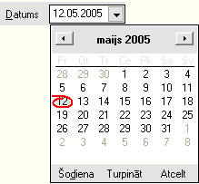
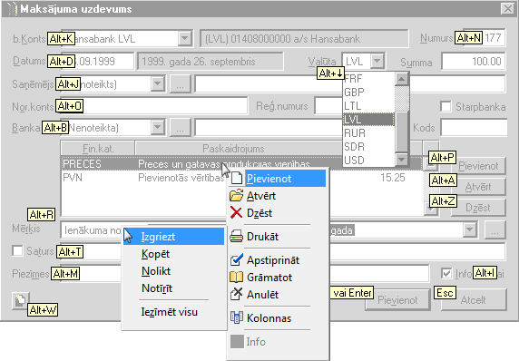

.. 14015
 
Dažāda veida lauku aizpildīšana
***********************************
 

Datuma lauki
++++++++++++

Datuma lauki ir paredzēti datuma ievadīšanai. Datuma laukus var
aizpildīt no kalendāra vai ievadot ar klaviatūras palīdzību. Datuma
lauku gada skaitlis aizpildās automātiski.

Ievadiet datuma laukā vajadzīgās dienas datumu un mēnesi, spiediet
taustiņu Tab , lai pārietu pie nākamā lauka aizpildīšanas. Sistēma
automātiski papildinās lauku ar patreizējo gada skaitli. Gadījumā, ja
dienas vai mēneša datums sastāv no viencipara skaitļa, nav
nepieciešams ievadīt nulles šo skaitļu priekšā!

Datuma lauku var aizpildīt ar kalendāra palīdzību. Kalendāru var
atvērt ar taustiņu kombinācijas Alt+ |images_ozols/24591.gif| (bulta
„Uz leju”) palīdzību vai izmantojot peli.

Nepieciešamo datumu no kalendāra var izvēlēties ar peles palīdzību.
Pašreizējās dienas datumu var izvēlēties ar datuma komandpogas
palīdzību. Izmantojot datuma komandpogai blakus esošās pogas, var
atvērt pagājušā vai nākamā mēneša datumus.

|images_ozols/24592.gif|

|images_ozols/24593.gif|

|images_ozols/24626.gif|

Kalendārs
+++++++++

Datuma laukus var aizpildīt no kalendāra. Kalendāru var izsaukt ar
taustiņu kombinācijas Alt+ |images_ozols/24591.gif| palīdzību vai
izmantojot *peli*.

|images_ozols/24626.gif|

+ Datuma izvēle ar klaviatūras palīdzību

Ar virziena taustiņiem ( |images_ozols/24595.gif|
|images_ozols/24597.gif| |images_ozols/24591.gif|
|images_ozols/24596.gif| ) pārvietojieties uz izvēlēto datumu. Pa
mēnešiem var pārvietoties ar taustiņu PageUp vai PageDown palīdzību.
Pārvietoties pa gadu var ar taustiņu Ctrl+PageUp un Ctrl+PageDown
palīdzību. Datuma izvēli veiciet ar taustiņa Enter palīdzību.
Kalendāru bez datuma izvēles var aizvērt spiežot taustiņu Esc .

+ Datuma izvēle ar *peles *palīdzību

Nepieciešamo datumu no kalendāra var izvēlēties ar *peles* palīdzību.
Ar *peli *noklikšķiniet uz izvēlēto datumu. Pa mēnešiem
pārvietojieties ar komandpogu |images_ozols/24598.gif| un
|images_ozols/24599.gif| palīdzību. Lai aizvērtu kalendāru un ieliktu
izvēlēto datumu datuma ievades laukā (no kura tika izsaukts
kalendārs), spiediet komandpogu Turpināt . Kalendāru bez datuma
izvēles var aizvērt spiežot komandpogu Atcelt . Uz šodienas datumu
kalendāru var pārvietot ar komandpogu Šodiena . Jebkurā gadījumā pēc
datuma izvēles jāspiež komandpoga Turpināt vai taustiņš Enter .

Ar *peli *ir ērti izvēlēties mēnešus. Šim nolūkam jānoklikšķina uz
mēneša nosaukuma kalendāra virsrakstā. Atvērsies visa gada mēnešu
izvēlne:

|images_ozols/24625.gif|

Tāpat, noklikšķinot uz gada skaitļa kalendāra virsrakstā, parādīsies
gada maiņas komandpogas:

|images_ozols/24624.gif|

Darbs ar tekstu
+++++++++++++++

Darbā ar tekstu ir ērti ir izmantot iespēju īslaicīgi saglabāt tekstu
datora atmiņā. Ja ir nepieciešams ievadīt vienu un to pašu informāciju
vairākkārtīgi dažādās sistēmas formās, var izmantot datu kopēšanas,
izgriešanas un nolikšanas iespējas.

Iezīmējiet nepieciešamo tekstu un izmantojiet rīku joslas ikonas vai
taustiņu kombinācijas, līdzīgi, kā MS Office programmās. Darbam ar
tekstu jāizmanto rīku joslas komandas Izgriezt, Kopēt, Nolikt. Komandu
aktivizēšanai var lietot arī taustiņu kombinācijas.

Lai izgrieztu iezīmēto tekstu, jālieto taustiņu kombinācija Ctrl+X .
Uzklikšķinot kursoru vietā, kur jānovieto teksts, jālieto taustiņu
kombinācija Ctrl+V , lai noliktu izgriezto tekstu. Līdzīgi var kopēt
iezīmēto tekstu, izmantojot kombināciju Ctrl+C . Komandu aktivizēšanas
taustiņu kombinācijas ir redzamas galvenajā izvēlnē.

Izmantojot teksta kopēšanas iespēju, var mainīt burtu reģistru no
izvēlnes

>Teksts > Bufera reģistrs

Teksta bufera reģistru var izmantot sekojoši:

+ ar taustiņu kombinācijas Ctrl+C palīdzību, jānokopē teksts;
+ ja tekstu nepieciešams pārvietot citā laukā, var izmantot teksta
izgriešanas taustiņu kombināciju Ctrl+X ;
+ no izvēlnes >Teksts > Bufera reģistrs jāizvēlas teksta reģistrs -
Augšējais, Apakšējais vai Teikums;
+ ar taustiņu kombinācijas Ctrl+V palīdzību jānovieto teksts
  nepieciešamajā vietā.

|images_ozols/24545.gif| Bufera reģistru var izmantot tikai tādos
ekrāna formu laukos, kur dati tiek ievadīti ar klaviatūras palīdzību.
Fiksētās izvēles laukos bufera reģistrs nedarbosies

Bufera reģistrs
+++++++++++++++

Paskaidrojums
+++++++++++++
Augšējais Visi teksta burti ir lielie Apakšējais Visi teksta burti ir
mazie Teikums Vārda pirmais burts ir lielais

Taustiņu lietošana
++++++++++++++++++

Visas nepieciešamās darbības grāmatvedības sistēmā var veikt ar
taustiņu kombināciju palīdzību. Grāmatvedības sistēmas "Ozols"
datorprogrammās izmantojamajiem taustiņiem Enter, Tab, Esc, Shift+Tab
ir speciāla nozīme.

Darbības apstiprināšanai lietojiet taustiņu Enter . Tomēr lietojiet šo
taustiņu apdomīgi! Atšķirībā no DOS programmām, taustiņš Enter bieži
vien aizver visu ekrāna formu – pievieno dokumentu.

Nepareizas taustiņa lietošanas gadījumā, ja ir pievienots vēl
nepabeigts dokumentu, nesāciet to veidot atkārtoti! Atrodiet šo
ierakstu ekrāna formā un labojiet to, papildinot ar visu nepieciešamo
informāciju.

Taustiņu Enter var lietot, lai pievienotu izveidoto dokumentu pārējo
dokumentu sarakstam vai apstiprinātu izvēlēto ierakstu fiksētas
izvēles lauka aizpildīšanai. Atteikšanās gadījumā lietojiet taustiņu
Esc . Šis taustiņš paredzēts arī formu aizvēršanai, aktivizējot
komandu Atcelt vai Aizvērt.

Pārvietoties pa formu laukiem uz leju iespējams, izmantojot taustiņu
Tab . Pārvietoties uz augšu - lietojot taustiņu kombināciju Shift+Tab
. Tomēr reizēm šāda veida darbības var aizņemt daudz laika. Taustiņu
kombinācijas var izmantot, lai aktivizētu noteiktu komandu vai
novietotu kursoru noteiktā ekrāna formas laukā.

Taustiņu kombinācijas
+++++++++++++++++++++

Darbā ar grāmatvedības sistēmu "Ozols", līdzīgi kā visās Windows
programmās, var izmantot peli, bet jebkuru operāciju var veikt tikai
ar klaviatūras palīdzību. Taustiņu kombināciju lietošana ir pilnīgi
nepieciešama, ja jāievada liels datu daudzums – samazinās patērētais
laiks un paaugstinās darba ražīgums. Taustiņu kombinācijas var lietot
darbā ar tekstu.

Atverot kādu no ekrāna formām, redzams, ka katra lauka nosaukumā ir
pasvītrots kāds burts. Lietojiet taustiņu Alt+pasvītrotais burts , lai
paātrināti piekļūtu Jums nepieciešamajam laukam! Īpaši ērti ir tas, ka
šīs kombinācijas nebūt nav jāmācās no galvas, atverot jaunu formu,
pasvītroto burtu un taustiņu lietošanas kombinācijas būs līdzīgas, un
tās būs redzamas jūsu datora ekrānā.

Lai atvērtu izvēlni, piemēram, Atskaites, spiediet taustiņu Alt+E
(burts "e" ir pasvītrots vārdā "Atskaites") un spiediet nākošo burta
taustiņu, piemēram, atskaites nosaukumā pasvītroto A, lai atvērtu
sociālās apdrošināšanas atskaites formu.

Komandu aktivizēšanai, kas ir kopējas visai sistēmai, lietojiet
taustiņa Ctrl+pasvītrotais burts kombināciju. Šādas komandas un arī to
taustiņu kombinācijas ir redzamas izvērstā galvenajā izvēlnē.

Taustiņu kombinācija
++++++++++++++++++++

Paskaidrojums
+++++++++++++
Tab Pārvietošanās pa ekrāna formas laukiem uz leju Shift+ Tab
Pārvietošanās pa ekrāna formas laukiem uz augšu Esc Ekrāna formas
aizvēršana, komandas atcelšana Enter Dialoga vai ekrāna formas
aizvēršana, ieraksta pievienošana,
labošana, fiksētās izvēles lauka aizpildīšana Alt+ pasvītrotais burts
Paātrināta pieeja laukam, komandas aktivizēšana Ctrl+ pasvītrotais
burts Kopējo darbību aktivizēšana galvenajā izvēlnē Alt+
|images_ozols/24591.gif| Fiksētās izvēles lauka izvēlnes atvēršana
Shift+ |images_ozols/24591.gif|
Paplašinātā saraksta atvēršana, ja aiz lauka ir paplašinātās izvēlnes

komandpoga ( |images_ozols/24714.gif| )

|images_ozols/25300.png|

.. |images_ozols/24592.gif| image:: images_ozols/24592.gif
       :scale: 100%

.. |images_ozols/24593.gif| image:: images_ozols/24593.gif
       :scale: 100%

.. |images_ozols/24595.gif| image:: images_ozols/24595.gif
       :scale: 100%

.. |images_ozols/24597.gif| image:: images_ozols/24597.gif
       :scale: 100%

.. |images_ozols/24596.gif| image:: images_ozols/24596.gif
       :scale: 100%

.. |images_ozols/24598.gif| image:: images_ozols/24598.gif
       :scale: 100%

.. |images_ozols/24599.gif| image:: images_ozols/24599.gif
       :scale: 100%

.. |images_ozols/24625.gif| image:: images_ozols/24625.gif
       :scale: 100%

.. |images_ozols/24624.gif| image:: images_ozols/24624.gif
       :scale: 100%

.. |images_ozols/24545.gif| image:: images_ozols/24545.gif
       :scale: 100%


 
