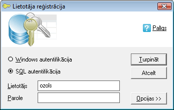

.. 14032
 
==========================
Lietotāja reģistrācija
==========================
 

Palaižot programmatūru, tiek atvērta lietotāja reģistrācijas ekrāna
forma:

|images_ozols/24697.png|

Lietojot izvēli Windows autentifikācija, automātiski tiek izmantota
lietotāja datortīkla parole.
Lietojot izvēli SQL autentifikācija, laukā Lietotājs jāieraksta
administratora piešķirtais lietotāja vārds un laukā Parole –
administratora piešķirtā lietotāja parole.

Atkarībā no uzņēmuma datortīkla konfigurācijas, Windows
autentifikācija var nebūt iespējama, un tiks parādīts paziņojums, ka
savienojumu nav iespējams izveidot. Šādā gadījumā jāizmanto SQL
autentifikācija - administratora piešķirtais lietotājvārds un parole.

Pēc Lietotājvārds un Paroles ierakstīšanas jānospiež poga
|images_ozols/24542.jpg| un tiks ielādēta datorprogramma Ozols, kurā
atvērsies vadības logs.


 
.. toctree::
   :maxdepth: 5
 
   14132.rst
