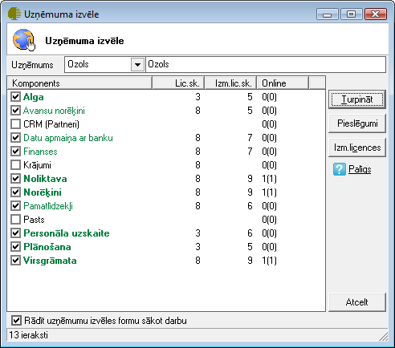
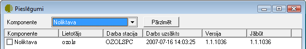

.. 14033
 
=================================
Komponentu un uzņēmuma izvēle
=================================
 

Lietotāju licenču, komponentu un uzņēmumu izmantošana
+++++++++++++++++++++++++++++++++++++++++++++++++++++

Vienlaicīgs lietotāju pieslēgums katram no komponentiem tiek
ierobežots ar iegādāto licenču skaitu. Lietotājs var izmantot dažādu
uzņēmumu datus. Uzņēmumu un komponentu datu lietošanu jānosaka sākot
darbu ar sistēmu.

Pieteikšanās uzņēmuma un komponentu izmantošanai
++++++++++++++++++++++++++++++++++++++++++++++++

Reģistrējoties sistēmā tiks parādīta komponentu izvēles ekrāna forma.

|images_ozols/24699.png|

Kolonnā licenču skaits parādās uzņēmuma iegādāto licenču skaits.
Komponentu izvēles ekrāna formā redzams, kuras komponentes var
izmantot. Ja licenču skaits ir vienāds ar izmantoto licenču skaitu,
tad pieslēgties šādam komponentam nebūs iespējams, jo jau tiek
izmantotas visas iegādātās licences.

Uzklikšķinot uz komponenta ieraksta, tiek atvērta informatīva ekrāna
forma, kurā redzams, kuri lietotāji izmanto komponenta licences.

|images_ozols/24700.png|

Ja lietotāju ir vairāk, nekā iegādāto licenču un vienlaicīgs darbs ar
komponentiem visiem nav iespējams, tad ekrāna formā (>Palīgs >
Komponenti un uzņēmuma izvēle) jāaktivizē komanda Rādīt komponentu
izvēli sākot darbu. Uzsākot darbu ar programmu, komponentu izvēles
forma vienmēr tiks aktivizēta.

|images_ozols/24539.jpg|

Laukā Uzņēmums tiek parādīts uzņēmums, kura datiem lietotājs vēlas
pieslēgties. Ja lietotājam ir pieejami vairāku uzņēmumu dati, tad
sākot darbu ar sistēmu jānorāda viens uzņēmums – tas, kuram tiks
veikta datu ievade un apstrāde.

|images_ozols/24698.png|

Lai varētu veidot jaunus dokumentus, lietotājam sākot darbu ar sistēmu
jānorāda viens uzņēmums, kura dati tiks lietoti.
Lai parādītu visus lietotājam pieejamos uzņēmumu datus vienlaicīgi,
jāaktivizē komanda Rādīt sarakstos visus pieejamos uzņēmumus. Šajā
darba režīmā dokumentu žurnālos un atskaitēs varēs iegūt kopsavilkuma
datus par visiem lietotāja uzņēmumiem, bet pievienot jaunus dokuments
varēs tam uzņēmumam, kas uzsākot darbu norādīts laukā Uzņēmums.

Komponentu un uzņēmumu maiņa
++++++++++++++++++++++++++++

Ja lietotājs ir strādājis ar programmu un lietojis noteikta uzņēmuma
datus, tad pārslēgties uz cita uzņēmuma datiem var no darba režīma:

> Palīgs > Uzņēmuma izvēle
Lai pārslēgtos uz cita uzņēmuma datiem, jāizvēlas uzņēmums laukā
Uzņēmums un var izmantot iespēju parādīt visu uzņēmumu datus kopā,
aktivizējot komandu: |images_ozols/24541.jpg|

Atteikšanās no komponentu izmantošanas
++++++++++++++++++++++++++++++++++++++

Lai atteiktos no komponenta izmantošanas un to varētu izmantot citi
lietotāji, ja ir ierobežots licenču skaits, jābeidz darbs ar
programmu.
Beidzot darbu ar programmu, tiek beigta arī komponentu izmantošana.

.. |images_ozols/24698.png| image:: images_ozols/24698.png
       :scale: 100%

.. |images_ozols/24541.jpg| image:: images_ozols/24541.jpg
       :scale: 100%


 
