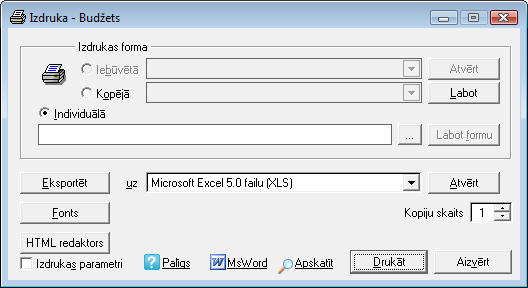

.. 14034
 
Dokumentu drukāšana
***********************
 

Grāmatvedības sistēmas "Ozols" datorprogrammās var izdrukāt
dokumentus, dokumentu žurnālus un sagatavotās atskaites. Dokumentu
žurnālus un grāmatvedības dokumentus var izdrukāt no atvērtām ekrāna
formām. Izdrukas iespējas ir iebūvētas datorprogrammā un par iespēju
izmantot drukāšanu liecina aktīva rīku joslas komanda Drukāt.

Izveidotos dokumentus var izdrukāt, izmantojot rīku joslu vai no
galvenās izvēlnes

Dati / Drukāt

Izdrukas ekrāna formā var izvēlēties iebūvēto izdrukas formu, kopējo
vai individuālo formu, aktivizējot attiecīgos pārslēdžus Iebūvētā,
Kopīgā vai Individuālā. Atskaiti var eksportēt uz teksta failu, MS
Excel 5.0 failu, MS Visual Foxpro 5.0 failu, Dbase 3 failu.

Logā Kopiju skaits var norādīt izdrukājamo kopiju skaitu.

Izdrukas dialoga ekrāna formu var atvērt, aktivizējot izvēles rūtiņu
Izsaukt izdrukas dialogu un spiežot komandpogu Drukāt.

Dokumentus var izdrukāt ar atdalošajām joslām. Dokumentu izdrukā var
iestādīt dažādus fontu veidus. Ja atskaišu izdrukām ir izvēlēts fonts,
tā nosaukums parādās izdrukas ekrāna formā blakus komandpogai Fonts.

**Objekts** **Paskaidrojums** Iebūvētā Iebūvētās izdrukas izmantošana
Kopējā Kopējās izdrukas izmantošana Individuālā Individuālās izdrukas
izmantošana Atvērt Iebūvētās izdrukas formas atvēršana Labot Kopējās
izdrukas formas labošana Labot formu Individuālās izdrukas formas
labošana Eksportēt Datu eksportēšana uz norādīto faila veidu Atvērt
Norādītā faila veida atvēršana Fonts Atskaišu izdrukas fonta
iestādīšana Kopiju skaits Drukājamo kopiju skaita norādīšana Izdrukas
parametri Izdrukas dialoga izsaukšana Palīgs Palīdzības sistēmas
izsaukšana Teksts Dokumenta atvēršana teksta failā Apskatīt Dokumenta
priekšapskate Drukāt Dokumenta drukāšana Aizvērt
Ekrāna formas aizvēršana

|images_ozols/25301.png|


 
.. toctree::
   :maxdepth: 4
 
   14035.rst
