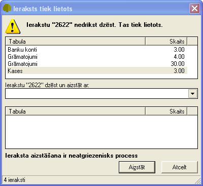

.. 14042
 
Saraksta dzēšana ar aizvietošanu
************************************
 

Ja saraksta ieraksts tiek izmantots dokumentos, to dzēst nevar. Ja
nepieciešams dzēst saraksta ierakstu, to var izdarīt, dzēšot ar
aizvietošanu. Lietojot dzēšanu ar aizvietošanu, jāizsver tā
nepieciešamība. Dzēst ar aizvietošanu varētu gadījumos, kad piemēram
ir jālabo kontu plāns un lielu daudzumu grāmatojumus no dzēšamā konta
jāpārnes uz citu kontu. Vai ja ir izveidoti divi vienādi partneru
apraksti un izveidotie dokumenti ir jāapvieno, tad vienu partnera
aprakstu dzēš aizstājot ar citu partnera aprakstu

Lai dzēstu jau dokumentos izmantotu saraksta ierakstu:

1) jāatver saraksts un jāiezīmē dzēšamais ieraksts.

2) jālieto komanda |images_ozols/24719.JPG| . Tiks parādīta ekrāna
forma, ka ieraksts tiek izmantots.

|images_ozols/24739.png|

3) ekrāna formā jānorāda ar kuru ierakstu dzēstais ir jāaizstāj. Visos
izveidotajos dokumentos un citos sarakstos dzēstais ieraksts tiks
aizvietots ar ekrāna formā norādīto.

4) jālieto komanda Aizstāt, ieraksta pārvietošanai. Tiks parādīt
jautājums par ieraksta aizstāšanu, uz kuru jāatbild „Jā”.

5) pirms ieraksta dzēšanas tiks parādīts jautājums par ieraksta
dzēšanu. Atbildot „Jā”, ieraksts tiks dzēsts.

.. |images_ozols/24719.JPG| image:: images_ozols/24719.JPG
       :scale: 100%


 
