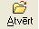
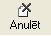
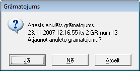

.. 14049
 
Dokumenta labošana
**********************
 

Lai dokumentu labotu ir:

1) jāatver dokuments no dokumentu žurnāla. ( CtrL+A , komanda
|images_ozols/24720.JPG| no rīku joslas, nospiežot peles labo pogu un
izvēloties komandu "Atvērt" vai komanda "Atvērt" no izvēlnes Dati

2) ja dokuments ir iegrāmatots, jāanulē grāmatojums. Ja grāmatojums ir
apstiprināts, ir jānoņem apstiprinājums no grāmatojuma un tad jāanulē
grāmatojums.Atvērto grāmatojumu anulē, izmantojot komandu
|images_ozols/24717.JPG| no rīku joslas, komandu "Anulēt" no izvēlnes
Dati vai nospiežot peles labo pogu un izvēloties komandu "Anulēt".
Anulēts grāmatojums tiek saglabāts grāmatojumu žurnālā apskates
režīmāun nepieciešamības gadījumā šādu grāmatojumu ir iespējams
atjaunot.

3) ja dokuments ir apstiprināts, tad jānoņem apstiprinājums ( CtrL+R;
komanda |images_ozols/24715.JPG| no rīku joslas; komanda "Apstiprināt"
no izvēlnes Dati, vai nospiežot peles labo pogu izvēlamies komandu
"Apstiprināt"). Dokumenta apstiprināšana un apstiprinājuma noņemša
tiek veikta ar vienām un tām pašām komandām.

4) jālabo dokuments

5) izlabotais dokuments atkal jāapstiprina ( CtrL+R vai
|images_ozols/24715.JPG| )

6) jāizveido jauns grāmatojums vai jāatjauno bijušais grāmatojums (
CtrL+G vai |images_ozols/24716.JPG| ). Ja pirmdokumentam ir bijis
anulēts grāmatojums, tad vēlreiz grāmatojot šo dokumentu tiek
pārjautāts vai veidot jaunu grāmatojumu vai atjaunot jau anulēto
grāmatojumu

|images_ozols/25306.png|

- atbildot "jā" - anulētais grāmatojums tiks atjaunots

- atbildot "nē" - tiks izveidots jauns grāmatojums

- atbildot "atcelt" - grāmatojuma veikšana tiks atcelta

7) jāapstiprina grāmatojums ( CtrL+R vai |images_ozols/24715.JPG| )

.. |images_ozols/24715.JPG| image:: images_ozols/24715.JPG
       :scale: 100%

.. |images_ozols/24715.JPG| image:: images_ozols/24715.JPG
       :scale: 100%

.. |images_ozols/24716.JPG| image:: images_ozols/24716.JPG
       :scale: 100%

.. |images_ozols/24715.JPG| image:: images_ozols/24715.JPG
       :scale: 100%


 
