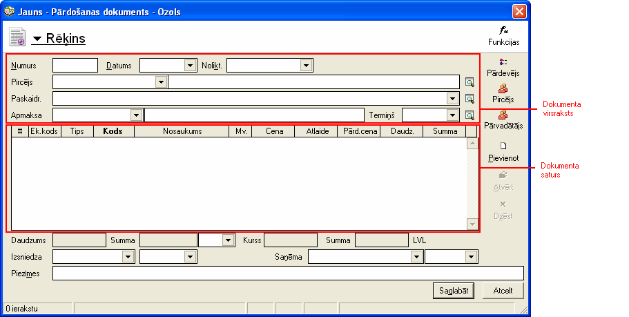
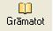

.. 14050
 
Jauna dokumenta pievienošana
********************************
 

Jaunu dokumentu pievienošana notiek dokumentu žurnālā. Dažādu
dokumentužurnāli atrodami zematbilstošā moduļa sadaļā "Dokumenti"

Lai pievienotu jaunu dokumentu var izmantot (vairākas programas
piedāvātās iespējas):

1) komandu |images_ozols/24708.png| no rīku joslas

2) taustiņu kombināciju Alt+P

3) komandu "Pievienot" no izvēlnes Dati

Atrodoties dokumentu žurnālā, jaunu dokumentu var pievienot strādājot
ar peles labo pogu.

Nospiežot peles labo poguunizvēloties komandu "Pievienot"

Kad ir pievienots jauns dokuments, ir jāizvēlas dokumenta veids.

|images_ozols/25150.png|

Katram dokumentam ir definēti savi dokumenta veidi. Jāizvēlas tas
dokumenta veids, kurš dotajā ievades brīdī ir nepieciešams.

Pēc dokumenta veida izvēles ir jāaizpilda dokumenta virsraksta un
satura sadaļas.

|images_ozols/25146.png|

Ja dokuments ir aizpildīts, ir divas iespējas, kā saglabāt dokumentu:

1) nospiežot pogu |images_ozols/24615.jpg| (šādi dokuments tiks
saglabāts, bet būs iespēja veikt korekcijas, ja tas būs nepieciešams)

2) nospiežot pogu |images_ozols/24715.JPG| no rīku joslas, dokuments
tiek apstiprināts un nozīmē, ka dokumenta sagatavošana ir pabeigta.

Dokumentu var apstiprināt arī izmantojot taustiņu kombināciju CtrL+R ,
izvēloties komandu "Apstiprināt" no izvēlnes Dati vainospiežot peles
labo pogu un izvēloties komandu "Apstiprināt"

Pēc dokumenta aizpildīšanas un tā saglabāšanas, dokuments ir
jāiegrāmato.

Iegrāmatot var tikai apstiprinātu dokumentu. Dokumentu variegrāmatot
izmantojot:

1) komandu |images_ozols/24716.JPG| no rīku joslas

2) taustiņu kombināciju CtrL+G

3) nospiežot peles labo pogu un izvēloties komandu "Grāmatot"

4) izvēloties komandu "Grāmatot" no izvēlnes Dati

Grāmatojuma ekrāna formā jāizvēlas atbilstošais grāmatojumu šablons.
Kad grāmatojums ir izveidots, tas ir jāapstiprina.

Dokuments tiek uzskatīts par sagatavotu un pabeigtu, ja ir veiktas
šādas darbības:

1) pievienots jauns dokuments

2) aizpildīts dokumenta virsraksts un saturs

3) dokuments ir apstiprināts

4) dokuments ir iegrāmatots

5) dokumenta grāmatojums ir apstiprināts

.. |images_ozols/24708.png| image:: images_ozols/24708.png
       :scale: 100%

.. |images_ozols/25150.png| image:: images_ozols/25150.png
       :scale: 100%

.. |images_ozols/24615.jpg| image:: images_ozols/24615.jpg
       :scale: 100%

.. |images_ozols/24715.JPG| image:: images_ozols/24715.JPG
       :scale: 100%


 
