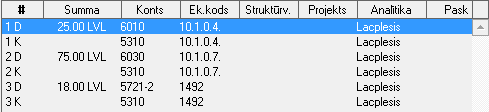
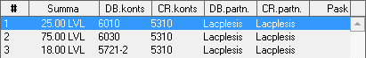

.. 14052
 
Grāmatojuma ekrāna formas skati
***********************************
 

Grāmatojuma ekrāna formai ir pieejami divu veidu skati, starp kuriem
var pārslēgties ar komandām: |images_ozols/25036.png| un
|images_ozols/25037.png| . Šie skati nemaina grāmatojuma būtību, tikai
atšķirīgi parāda datu izkārtojumu uz ekrāna. Lietotājs var izvēlēties
kurš skats ir ērtāks lietošanai.
Skats |images_ozols/25037.png| vienu kontējumu parāda izkārtotu divās
rindās, kur 1D ir pirmās rindas debeta dati un 1K ir pirmās rindas
kredīta dati. Šādu izkārtojumu var lietot, piemēram, ja monitora
izmēra dēļ otrā skata grāmatojuma dati nav pārskatāmi:

|images_ozols/25038.png|

Skats |images_ozols/25036.png| vienu kontējumu parāda vienā rindā.
Šajā skatā var parādīt vairāk kolonnas – datus no izveidotā
grāmatojuma. Parādāmās kolonnas uz ekrāna var konfigurēt izmantojot
komandu Kolonnas |images_ozols/24952.png| , komandu izvēli izsaucot ar
labo peles pogu uzklikšķinot grāmatojuma saturā:

|images_ozols/25039.png|

.. |images_ozols/24952.png| image:: images_ozols/24952.png
       :scale: 100%


 
