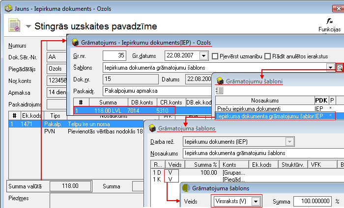

.. 14057
 
Grāmatojuma šablona ieraksta veids
**************************************
 

Katra šablona rinda rezultāta grāmatojumā var radīt vienu vai vairākas
rindas, atkarībā no tā, vai šablona rindas veids ir Virsraksts, vai
tas attēlo pirmdokumenta Saturu.

Lauka Veids vērtības var būt Virsraksts (V) vai Saturs (S):

|images_ozols/25116.png|

Virsraksts – grāmatojumā parādīsies tikai viena, fiksēta rinda no šīs
grāmatojuma šablona rindas. Piemēram, dokumenta kopējā summa no
maksājuma uzdevuma virsējās daļas:

|images_ozols/25117.png|

Saturs - viena šablona rinda radīs tik rindas grāmatojuma saturā, cik
rindu ir pirmdokumenta saturā. Piemēram, ja dokumenta kopējā summa ir
118 Ls, bet dokumenta saturā ir atdalīts, ka 100Ls attiecas uz
pakalpojumiem, bet 18Ls ir PVN, tad šajā gadījumā grāmatojumā tiks
ģenerētas divas grāmatojuma rindas, kur 100Ls un 18Ls summām var būt
atšķirīgs kontējums:

|images_ozols/25118.png|

|images_ozols/24545.gif| Ieraksta veids Saturs vienmēr ir jāizmanto
budžeta iestādēm, ja grāmatojumā jāpievieno ekonomiskās klasifikācijas
kodi. Ieraksta veids Saturs pareizi tiks pielietots tikai tad, ja
pirmdokumentam būs aizpildīts dokumenta saturs.

.. |images_ozols/24545.gif| image:: images_ozols/24545.gif
       :scale: 100%


 
