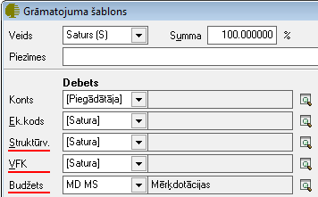

.. 14063
 
Dimensiju izmantošana grāmatojuma šablonā
*********************************************
 

Grāmatojuma šablonā pārējo dimensiju laukos (Struktūrvienība,
Projekts, Nozare, u.c.)laukos iespējams norādīt konkrētu
izvēlētuvērtību nodimensiju klasifikatoriemvai noklusēto vērtību no
pirmdokumenta satura:

|images_ozols/25128.png|

Struktūrvienība – Bankas un Kases dokumentu grāmatojumu šablonos
struktūrvienības laukā norādot Bankas vai Kases, struktūrvienība
grāmatojumā tiks ielikta no :doc:`Banku konta apraksta<141>` vai
:doc:`Kases konta apraksta<123>` .
Struktūrvienību atsevišķos darba režīmos var pievienot kā Virsraksta –
tas nozīmē, ka grāmatojumā struktūrvienība tiks ielikta no
pirmdokumenta apraksta. Ja ir pieejama izvēle Satura – tas nozīmē, ka
struktūrvienība tiks ielikta grāmatojumā no datiem, kas ir pievienoti
pirmdokumenta saturā.

Projekts – Projektu var izmanot, ja grāmatvedības dati tiek sīkāk
sadalīti pa konkrētiem projektiem. Ja ir pieejama izvēle Satura - tas
nozīmē, ka projekts tiks ielikts grāmatojumā no datiem, kas ir
pievienoti pirmdokumenta saturā.

Budžets – Izmantojot datu uzskaiti pa dimensijām, laukā Nozare var
norādīt konkrētu ierakstu, kurš tiks pievienots grāmatojumam. Ja ir
pieejama izvēle Satura - tas nozīmē, kabudžets tiks ielikts
grāmatojumā no datiem, kas ir pievienoti pirmdokumenta saturā.


 
