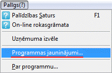
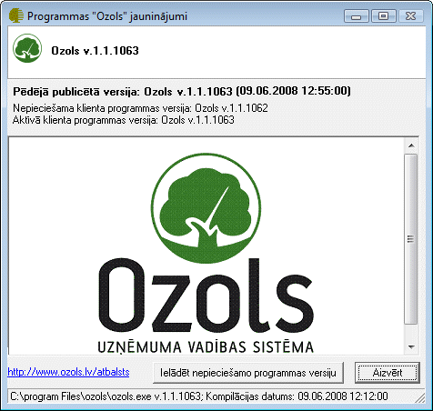
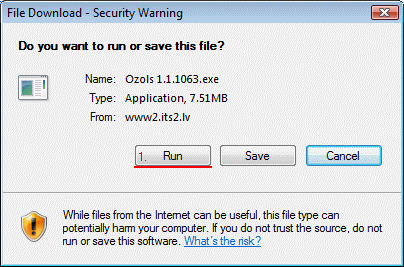
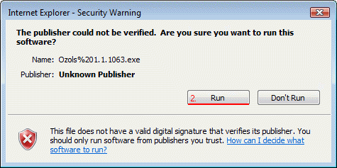
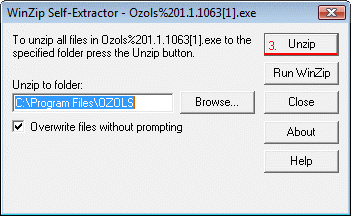

.. 14067
 
Manuāla
***********
 

No izvēlnes nepieciešams aktivizēt darba režīmu:

|images_ozols/25750.png|

Tiks atvērts Programmas "Ozols" jauninājumu logs:

|images_ozols/25752.png|

Ja Nesakrīt Nepieciešamā un Aktīvā programmas versijas, tad
nepieciešams uzstādīt jaunāko programmas versija, to var izdarīt
sekojoši:

- Nepieciešams izvēlēties komandu: |images_ozols/25753.png|

- Aizvērt programmu Ozols

- Datu ielādes ekrāna formānepieciešams izpildīt komandu[Run]

|images_ozols/25754.png|

- Vēlreiz izpildīt komandu [Run]

|images_ozols/25755.png|

- Izpildīt komandu [UnZip]

|images_ozols/25756.png|


 
