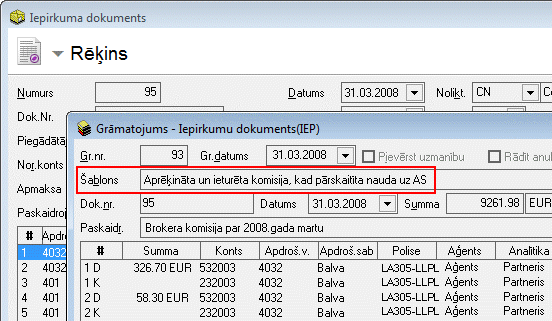

.. 14082
 
Polišu komisijas aprēķins
*****************************
 

Aprēķinātākomisijas nauda par Polisēm tiek grāmatota balstoties uz
sagatavotās :doc:`Polišu komisijas<6516>` atskaites datiem. No šīs
atskaites, izmantojot rīku joslā pieejamo pogu
|images_ozols/25374.png| , ir iespējams ģenerēt Iepirkuma vai
Pārdošanas dokumentu, kas kalpo kā pirmdokuments aprēķinātās polišu
komisijas summas grāmatošanai.

Rēķins tiek grāmatots atbilstoši izveidotajamAprēķinātās un ieturētās
komisijas :doc:`Grāmatojuma šablonam<14083>` :

|images_ozols/25375.png|

Izveidotais grāmatojums pieejams Polises aprakstā, sadaļā
"Grāmatojumi", kā arī, ja papildus Polišu modulim iegādāts Ozols bāzes
modulis, grāmatojums pieejams :doc:`Grāmatojumu žurnālā<131>` ,
atlasot datus pēc grāmatojuma veida "Iepirkuma dokuments (IEP)".


 
