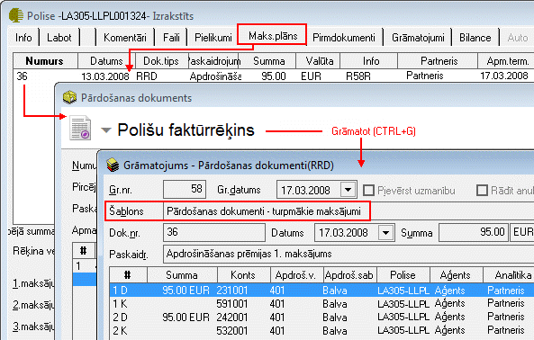

.. 14085
 
Polises maksājumu plānā definēto izrakstīto rēķinu grāmatošana
******************************************************************
 

Rēķins, kurš izrakstīts, balstoties uz Polises aprakstā definēto
Maksājumu plānu, tiek grāmatots atbilstoši izveidotajam Pārdošanas
dokumentu-turpmāko maksājumu :doc:`Grāmatojuma šablonam<14083>` :

|images_ozols/25373.png|

Izveidotais grāmatojums pieejams Polises aprakstā, sadaļā
"Grāmatojumi", kā arī, ja papildus Polišu modulim iegādāts Ozols bāzes
modulis, grāmatojums pieejams :doc:`Grāmatojumu žurnālā<131>` ,
atlasot datus pēc grāmatojuma veida "Pārdošanas dokumenti(RRD)".


 
