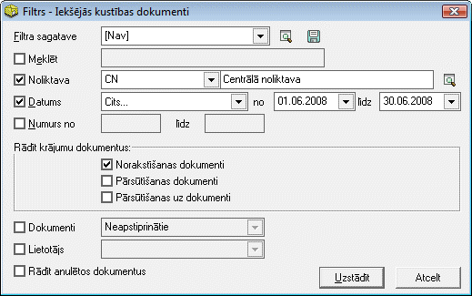
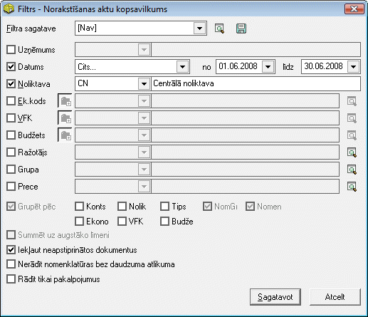

.. 14091
 
Nomenklatūras norakstīšanas aktu apskate Ozolā
**************************************************
 

->Ozols->Noliktava->Dokumenti-> :doc:`Iekšējās kustības
dokumenti<4455>`
++++++++++++++++

Iekšējās kustības dokumentu žurnāla filtrā iespējams norādīt
parametrus, pēc kādiem tiks atlasīti Nomenklatūras norakstīšanas
dokumenti:

|images_ozols/25811.png|

Uzstādot norādītos parametrus, tiks atlasīti Nomenklatūras
norakstīšanas dokumenti.

Šādi atlasītus dokumentus iespējams arī iegrāmatot:
:doc:`Nomenklatūras norakstīšanas dokumentu grāmatošana<14092>` .

->Ozols->Noliktava->Atskaites-> :doc:`Norakstīšanas aktu
kopsavilkums<808>`
++++++++++++++++++

Šajā atskaitē iespējams iegūt datus kopsavilkuma veidā par norakstīto
nomenklatūru. Atskaites „Norakstīšanas aktu kopsavilkums” filtrā,
iespējams norādīt parametrus, pēc kādiem atskaite tiks sagatavota:

|images_ozols/25812.png|

Uzstādot norādītos parametrus, tiks sagatavota atskaite, kurā
kopsavilkuma veidā tiks attēlota norakstītā nomenklatūra.

|images_ozols/24545.gif| Šo atskaiti ir iespējams izdrukāt, nospiežot
rīku joslā pogu |images_ozols/25813.png| .
Atskaites izdrukas virsrakstā tiek norādīts, kādos Nomenklatūras
norakstīšanas aktos ir norakstītas kopsavilkumā attēlotās
nomenklatūras. Dati atskaitē ir sagrupēti pa nomenklatūras grupām.

.. |images_ozols/24545.gif| image:: images_ozols/24545.gif
       :scale: 100%

.. |images_ozols/25813.png| image:: images_ozols/25813.png
       :scale: 100%


 
.. toctree::
   :maxdepth: 3
 
   14092.rst
