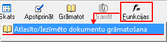
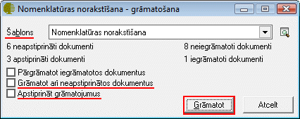
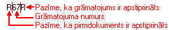

.. 14092
 
Nomenklatūras norakstīšanas dokumentu grāmatošana
*****************************************************
 
|images_ozols/null.GIF|

Nomenklatūras norakstīšanas dokumentus iespējams grāmatot
:doc:`Iekšējās kustības dokumentu žurnālā<14013>` , izmantojot rīku
joslas pogu |images_ozols/25814.png| .

|images_ozols/24545.gif| :doc:` Iekšējās kustības dokumentu žurnāla
<14013>` filtrā iespējams norādīt parametrus, pēc kādiem tiks atlasīti
Nomenklatūras norakstīšanas dokumenti grāmatošanai. Atlases
parametriem jābūt tādiem, kas atlasītu dokumentus, kuriem ir vienots
grāmatošanas princips.

Uzstādot norādītos parametrus, tiks atlasīti Nomenklatūras
norakstīšanas dokumenti. Šos dokumentus iespējams automatizēti
iegrāmatot, izmantojot rīku joslā esošo pogu:

|images_ozols/25815.png|

Izvēloties šo funkciju un "Nomenklatūras norakstīšanas - Grāmatošanas"
logānospiežot pogu „Grāmatot”, automātiski tiks iegrāmatoti visi
atlasīti Nomenklatūras norakstīšanas dokumenti, pēc norādītā
„Šablona”:

|images_ozols/25816.png|

Pēc pogas |images_ozols/25817.png| nospiešanas, :doc:` Iekšējās
kustības dokumentu žurnālā <14013>` kolonnā „Info” attēlotā
informācija liecina par to, ka šie dokumenti ir iegrāmatoti:

|images_ozols/25818.png|

.. |images_ozols/null.GIF| image:: images_ozols/null.GIF
       :scale: 100%

.. |images_ozols/24545.gif| image:: images_ozols/24545.gif
       :scale: 100%


 
