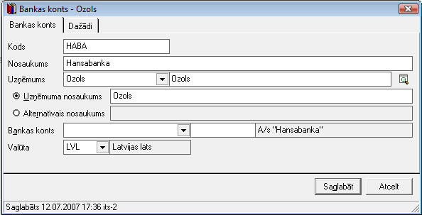
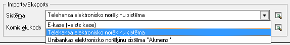
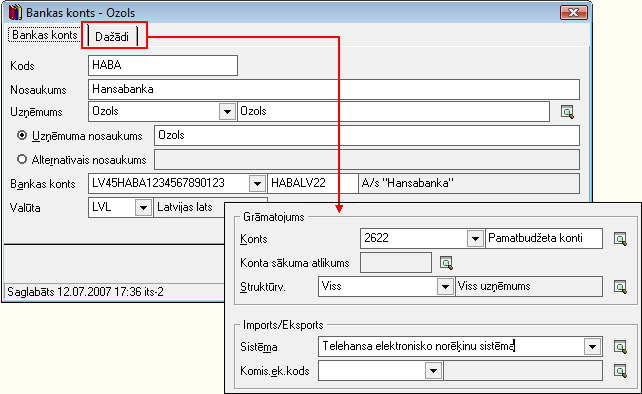

.. 141
 
Banku konti
***************
 


Sarakstā tiek saglabāti uzņēmuma banku konti, un tajā var pievienot
neierobežotu skaitu kontus. Banku konti tiek izmantoti bankas ieejošo
un izejošo dokumentu sagatavošanā. Konta aprakstā var norādīt
grāmatojumu kontu un sasaistīt ar uzņēmuma struktūrvienību, nodrošinot
bankas dokumentu automatizētu grāmatošanu. Banku kontiem var noteikt
elektronisko norēķinu sistēmu izmantošanu. Banku kontu var būt dažādās
valūtās.


JaunaBankas kontapievienošana:
``````````````````````````````

Lai pievienotu jaunu Bankas kontu, rīku joslājānospiež poga
|images_ozols/24708.png| un tiks atvērts jauns logs:


|images_ozols/24673.jpg|


AtvērtajāBankas kontaapraksta logā iespējams norādītBankas kodu
(saīsināts nosaukums), Nosaukumu, Norādīt uzņēmumu, uz kuru šis bankas
konts ir attiecināms.


Laukā Bankas konts, nepieciešams ierakstīt bankas konta numuru IBAN
formātā un norādīt attiecīgās bankas kodu (Piemēram, HABALV22):

|images_ozols/24701.png|


Laukā Valūta, nepieciešams norādīt bankas kontam atbilstošo valūtu:

|images_ozols/24702.png|


|images_ozols/24545.gif| Ja uzņēmums izmantomultivalūtu kontu, tad
Banku kontu sarakstā jāpievieno katrai valūtai atbilstošs ieraksts
(bankas konts).


Lai :doc:`Bankas ieņēmumu<226>` un :doc:`Bankas izdevumu<224>`
dokumentu grāmatošanas procesu padarītu ērtāku un būtu iespēja
grāmatot Bankas dokumentus, izmantojot :doc:`Grāmatojumu
šablonus<135>` , bankas konta aprakstā,sadaļā Dažādi,nepieciešams
piesaistīt grāmatvedisko kontu no :doc:`Kontu plāna<114>` :


|images_ozols/24703.png|


Bankas elektronisko norēķinu sistēmas piesaiste uzņēmuma Bankas kontam
++++++++++++++++++++++++++++++++++++++++++++++++++++++++++++++++++++++


Lai izmantotu :doc:`Datu apmaiņa ar banku<451>` , pievienotajam Bankas
kontam nepieciešams norādīt atbilstošu :doc:`Bankas elektronisko
norēķinu sistēmu<160>` , izvēloties sistēmu no sarakstā piedāvātajām:


|images_ozols/24704.png|


Kad visi nepieciešamie lauki ir aizpildīti, lai saglabātu jaunu Bankas
kontu, nepieciešams nospiest pogu |images_ozols/24615.jpg| .


Pievienotā Bankas konta labošana:
`````````````````````````````````

Lai veiktu labojumus pievienotajāBankas kontaaprakstā, ierakstu
nepieciešams atvērt, izmantojot rīku joslas pogu
|images_ozols/24709.png| (ALT+A), unatvērtajāierakstā iespējams
veiktnepieciešamos labojumus:


|images_ozols/24707.png|


Pēc labojumu veikšanas, veiktā izmaiņas iespējams
|images_ozols/24615.jpg| vai |images_ozols/24617.jpg| .


.. |images_ozols/24708.png| image:: images_ozols/24708.png
       :scale: 100%



.. |images_ozols/24701.png| image:: images_ozols/24701.png
       :scale: 100%

.. |images_ozols/24702.png| image:: images_ozols/24702.png
       :scale: 100%

.. |images_ozols/24545.gif| image:: images_ozols/24545.gif
       :scale: 100%

.. |images_ozols/24703.png| image:: images_ozols/24703.png
       :scale: 100%



.. |images_ozols/24615.jpg| image:: images_ozols/24615.jpg
       :scale: 100%

.. |images_ozols/24709.png| image:: images_ozols/24709.png
       :scale: 100%



.. |images_ozols/24615.jpg| image:: images_ozols/24615.jpg
       :scale: 100%

.. |images_ozols/24617.jpg| image:: images_ozols/24617.jpg
       :scale: 100%


 
