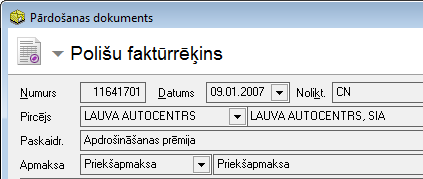
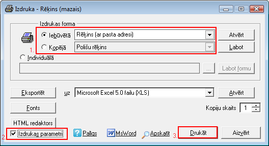
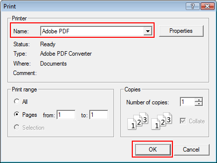
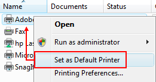

.. 14100
 
Dokumenta ģenerēšana .pdf formātā
*************************************
 

Lai ģenerētu pārdošanas dokumentu uz .pdf formātu no programmas Ozols:

1. Jāatver dokuments, kuru nepieciešams sagatavot .pdf formātā,
nosūtīšanai elektroniski:

|images_ozols/26007.png|

un rīku joslā jānospiež poga |images_ozols/25813.png| (Ctrl+P).

2. Jāizvēlās atbilstošā izdrukas forma (no saraksta - Iebūvētā vai
Kopējā), jāatzīmē izvēles rūtiņa "Izdrukas parametri" un jānospiež
poga |images_ozols/25620.png| :

|images_ozols/26008.png|

3. Print logā jāizvēlās atbilstošais printera vārds "Adobe PDF" vai
cits formāts (image writer. xps document writer), kas ģenerē dokumentu
.pdf formātā. Jānospiež poga OK un jānorāda failu katalogs, kur šis
dokuments .pdf formātā tiks saglabāts:

|images_ozols/26009.png|

4. Ja gadījumā šāds "Print" logs neparādās, tad var mēģināt kādu no
.pdf dokumentu režīmiem uz šo brīdi iestādīt kā noklusēto:

"Start" -> "Settings" -> "Printers" un izvēlēties atbilstošo
"printeri" - "Adobe PDF" vai "Microsoft Office Document Image Writer",
tad jānospiež peles labais taustiņš un jāizvēlas "Set as Default
Printer":

|images_ozols/26010.png|

.. |images_ozols/25813.png| image:: images_ozols/25813.png
       :scale: 100%

.. |images_ozols/25620.png| image:: images_ozols/25620.png
       :scale: 100%


 
