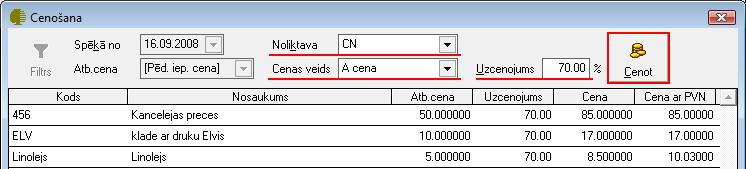

.. 14104
 
Preču cenošana no Iepirkumu dokumenta
*****************************************
 

Jāatlasa vēlamie iepirkuma dokumenti un atverot iepirkuma dokumentu,
kura iepirkuma saturs ir preces, dokumenta logā jānospiež poga ..
image:: images_ozols/25814.png
:scale: 100%
un jāizvēlas funkcija Cenot:

.. image:: images_ozols/26125.png
:scale: 100%

Izvēloties cenošanas funkciju, tiek atvērt cenošanas logs:

:scale: 100%

Spēkā no: datums, no kura stājas spēkā izveidotās cenas;

Atb.cena: atbalsta cena (pēdēja preces iepirkuma cena, kura tiek ņemta
no iepirkuma dokumenta satura ieraksta);

Noliktava: :doc:`noliktava<142>` uz kuru attieksies izveidotās cenas;

Cenas veids: jāizvēlas, kuram no nodefinētajiem :doc:`cenu
veidiem<105>` tiks izveidotas preču cenas;

Uzcenojums (%): ir iespējams ierakstīt noteiktu uzcenojuma procentu,
un, nospiežot pogu .. image:: images_ozols/26128.png
:scale: 100%
, visas iepirkuma dokumenta preces tiek uzcenotas.

Lai cenas tiktu saglabātas, jānospiež poga .. image::
images_ozols/25621.png
:scale: 100%
.

.. image:: images_ozols/24545.gif
:scale: 100%
Ir iespējams arī manuāli ierakstīt Cenu vai cenu ar PVN, un programma
automātiski aprēķinās uzcenojumu (%).

Izveidotās cenas tiek saglabātas :doc:`cenu sarakstā<749>` .

Iepirkuma dokumentā, izvēloties funkciju Cenot ar dokumentu:

.. image:: images_ozols/26129.png
:scale: 100%

Teik atvērt Cenošanas dokuments:

.. image:: images_ozols/26130.png
:scale: 100%

Automātiski Atbalsta cena tiek norādīta Pēdējā iepirkuma cena;

Spēkā no: datums, no kura stājas spēkā izveidotās cenas;

Noliktava: :doc:`noliktava<142>` tiek automātiski notādītā tā, kura ir
norādīta iepirkuma dokumentā;

Izsniedza: iespējams norādīt :doc:`atbildīgo personu<312>` ;

Cenas veids: jānorāda :doc:`cenu veids<105>` ;

Tad, nospiežot pogu .. image:: images_ozols/26131.png
:scale: 100%
, tiek atvērt logs, kur jānorāda :doc:`cenošanas metode<159>` (ja
norāda manuālo metodi, tad cenošana jāveic manuāli norādot procentuālu
uzcenojumu), un tiek norādīts iepirkuma dokuments, no kura tiek veikta
cenošana. Jānospiež poga .. image:: images_ozols/25619.png
:scale: 100%
, lai tiktu veikta cenošana un aizpildītos cenošanas dokumenta saturs.
Cenošanas dokuments tiek saglabāts :doc:`Cenošanas dokumentu
žurnālā<231>` , kur tiek saglabāti arī manuāli pievienotie
:doc:`cenošanas dokumenti<374>` .


 
