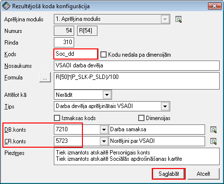

.. 14109
 
Grāmatvedisko kontu piesaistīšana algu rezultējošiem kodiem
***************************************************************
 

|images_ozols/24545.gif| Pirms algu grāmatojuma pirmdokumenta
veidošanas, algu rezultējošiem kodiem - ABruto, IIN, Soc_dn, Soc_dd un
Riska_nod - jābūt piesaistītiem Db un Cr grāmatvediskajiem kontiem!

Nepieciešamās darbības veicamas no darba režīma:
Alga->Konfigurācija->Rezultējošo kodu konfigurācija:

1. Rezultējošo kodu sarakstā, nepieciešams atrast kodu ABruto un
atvērt ierakstu;

2. Atvērtajā logā, laukos DB.konts un CR.konts jānorāda atbilstošais
debeta un kredīta konts:

|images_ozols/26236.png|

3. Ieraksts tiks saglabāts, nospiežot pogu |images_ozols/25621.png| .

4. Secīgi, pārējiem nepieciešamajiem algu rezultējošiem kodiem
jāpiesaista grāmatvediskais konts:

Iedzīvotāju ienākumu nodoklis (IIN):

|images_ozols/26237.png|

Darba devēja aprēķinātais VSAOI:

|images_ozols/26238.png|

Sociālais nodoklis darba ņēmēja:

|images_ozols/26240.png|

Riska nodeva:

|images_ozols/26241.png|

.. |images_ozols/24545.gif| image:: images_ozols/24545.gif
       :scale: 100%

.. |images_ozols/26236.png| image:: images_ozols/26236.png
       :scale: 100%

.. |images_ozols/25621.png| image:: images_ozols/25621.png
       :scale: 100%


 
