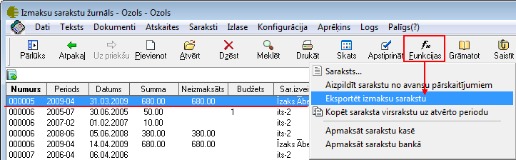
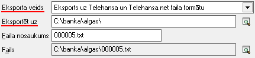

.. 14116
 
Izmaksu sarakstu eksports uz banku elektronisko norēķinu sistēmām
*********************************************************************
 

Sagatavotos algu, avansu vaistarpizmaksuizmaksu sarakstus var
eksportēt uz failiem elektronisko norēķinu veikšanai banku
pieprasītajā formātā. Sarakstus var eksportēt uz Unibankas DBF faila
formātu, Telehansanet faila formātu vai Krājbankas XLS faila formātu.

Lai eksportētu izmaksu sarakstu:
1.Jāatver vai jāiezimē nepieciešamais izmaksu saraksts, kura summas
jāeksportē un jālieto komanda Funkcijas->Eksportēt izmaksu sarakstu:

|images_ozols/26284.png|

2. Ekrāna formā jānorāda, uz kuru faila formātu dati jāeksportē,
jānorāda katalogs, kurā fails jāizveido un jānorāda faila nosaukums.
Lauka Fails dati tiks ievietoti automatizēti:

|images_ozols/26285.png|

Jālieto komanda Eksportēt datu eksportam.

3. Izmantojot komandu Eksportēt, tiks izveidots fails bankas
pieprasītajā formātā, kuru tālāk attiecīgi ir jāimportē bankas
elektronisko norēķinu sistēmā vai jānosūta bankai maksājuma uzdevumu
izpildīšanai.


 
