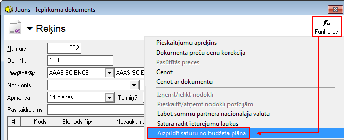
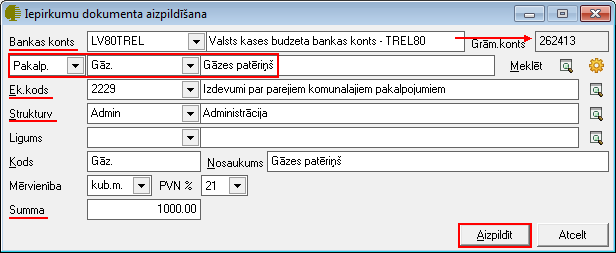
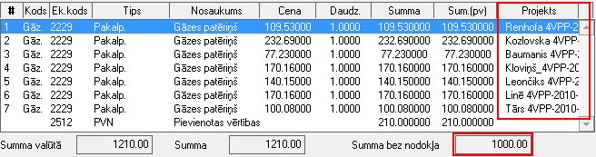

.. 14135
 
Iepirkumu dokumenta satura aizpildīšana no budžeta plāna
************************************************************
 
Sistēmā izstrādātā papildus funkcionalitāte (nepieciešama papildus
licence) nodrošina iepirkuma dokumenta satura aizpildīšanu atbilstoši
:doc:`Budžeta plānam<178>` - iepirkuma dokuments tiek automātiski
aizpildīts, atbilstoši infrastruktūras uzturēšanas izdevumu sadalei.
Ievadot :doc:`Iepirkuma dokumentu<310>` un aizpildot tā saturu, pēc
iepriekš nodefinētiem kritērijiem, summas automātiski iespējams
sadalīt starp projektiem, ņemot vērā plānoto gada finansējumu -
:doc:`Budžetu<178>` .

Informācija par plānoto gada finansējumu tiek ņemta no sastādītā
:doc:`Budžeta plāna<178>` , atbilstoši sekojošiem parametriem - konts
(grāmatvediskais konts un tam atbilstoši piesaistītais :doc:`Bankas
konts<141>` ), :doc:`Struktūrvienība<117>` , Algoritms - izdevumu.
Procentuālais sadalījums starp projektiem tiek veidots katra
:doc:`Bankas konta<141>` ietvaros.


Iepirkuma dokumenta satura aizpildīšana no budžeta plāna
````````````````````````````````````````````````````````
Lai aizpildītu dokumenta saturu atbilstoši minētajiem kritērijiem no
budžeta plāna, nepieciešams pievienot jaunu iepirkuma dokumentu
Iepirkumu dokumentu žurnālā. Pēc dokumenta Virsraksta aizpildīšanas,
nepieciešams izpildīt funkciju:

|images_ozols/26457.png|

Izpildot šo funkciju, tiks atvērts jauns satura logs, kur nepieciešams
norādīt pamatkritērijus, pēc kuriem iepirkuma dokumenta saturs tiks
aizpildīts:

|images_ozols/26458.png|

**Bankas konts:** Jāizvēlas atbilstošais bankas konts, balstoties uz
kuru tiks aizpildīts procentuālais sadalījums no budžeta plāna
**Pakalpojums:** Jānorāda pakalpojums, kurš iepirkuma dokumenta saturā
tiks sadalīts pa projektiem
**Ek.kods:** Lauks tiek aizpildīts automātiski, no pakalpojuma
aprakstā piesaistītā EK koda
**Struktūrvienība:** Nepieciešams norādīt struktūrvienību, kuras
ietvaros no budžeta plāna dati tiks aizpildīti
**Summa:** Jāievada dokumenta kopējā summa (bez PVN), kura tiks
procentuāli sadalīta balstoties uz budžeta plānu

Kad visi nepieciešamie dati norādīti, lai aizpildītu dokumenta saturu,
nepieciešams nospiest pogu "Aizpildīt".

Pēc šīs darbības izpildes, dokumenta saturs tiks aizpildīts atbilstoši
norādīto kritēriju procentuālajam sadalījumam no budžeta plāna:

|images_ozols/26459.png|

Pēc dokumenta satura aizpildīšanas, dokuments ir sekmīgi ievadīts un
to ir iespējams:

1. Saglabāt, nospiežot pogu |images_ozols/24615.jpg| -dokuments tiks
saglabāts un būs pieejams apskatei/labošanai/grāmatošana
:doc:`Iepirkumu dokumentu<210>` žurnālā;
2. Apstiprināt, nospiežot rīku joslā pogu |images_ozols/24740.png| -
iepirkumu dokuments tiks Apstiprināts un to būs iespējams Grāmatot.







.. |images_ozols/24615.jpg| image:: images_ozols/24615.jpg
       :scale: 100%

.. |images_ozols/24740.png| image:: images_ozols/24740.png
       :scale: 100%


 
