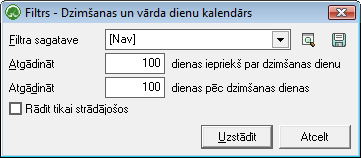

.. 143
 
Dzimšanas un vārda dienu kalendārs
**************************************
 

CRM atskaitē Dzimšanas un vārda dienu kalendārs, tiek attēlotidati,
par datu bāzē pievienotajiem :doc:`Partneriem<112>` (fiziskā
personām). Atskaitē iespējams redzēt informāciju par Partneru
dzimšanas datiem, vārda dienu, vecumu, kā arī Partnera
kontaktinofrmāciju.

Filtrs (rīku joslā poga |images_ozols/24535.gif| (Ctrl+F)) jāaizpilda,
lai sagatavotu atskaiti.

Dati uz ekrāna tiek parādīti atbilstoši norādītajiem datu atlases
kritērijiem filtra ekrāna formā. Filtru var uzlikt, lai ierobežotu
kādu datu parādīšanu uz ekrāna, iegūstot nepieciešamās izdrukas, vai
arī ātrāk sameklētu nepieciešamos datus. Filtrs tiek izmantots
atskaišu sagatavošanā un atsevišķu dokumentu satura aizpildīšanā.

Datu atlases kritērijus var saglabāt ( |images_ozols/24938.png| ).
Izvēloties izveidoto filtra sagatavi ( |images_ozols/24635.gif| ),
filtrs tiek automatizēti aizpildīts no filtra sagataves. Lai izveidotu
atskaiti pēc vēlamajiem kritērijiem, Rīku joslā jānospiež poga
|images_ozols/24535.gif| (Ctrl+F), tiek atvērts filtra logs:

|images_ozols/26066.png|

Atgādināt..dienas iepriekš par dzimšanas dienu: iespējams norādīt
dienu skaitu pirms Partnera dzimšanas dienas;

Atgādināt..dienas pēc dzimšanas dienas: iespējams norādīt dienu skaitu
pēc Partnera dzimšanas dienas.

|images_ozols/26067.png| - Izvēles rūtiņa jāatzīmē, ja nepieciešams
sagatvot atskaiti tikai par uzņēmumā :doc:`Strādājošajiem<111>` .

|images_ozols/24545.gif| Atzīmējot šādus filtra iestādījumus un
nospiežot pogu |images_ozols/25944.png| , tiks atlasīti visi tie
Partneri (fiziskas personas), kuriem dzimšanas diena iekļaujas laika
periodā - 100 dienas pirmds un 100 dienas pēc.

Izveidoto atskaiti ir iespējams izdrukāt, mainot skatu, rīku joslā
nospiežot pogu |images_ozols/24946.png| Skats, un tad nospiežot pogu
|images_ozols/24944.png| (Ctrl+P).

.. |images_ozols/24535.gif| image:: images_ozols/24535.gif
       :scale: 100%

.. |images_ozols/24938.png| image:: images_ozols/24938.png
       :scale: 100%

.. |images_ozols/24635.gif| image:: images_ozols/24635.gif
       :scale: 100%

.. |images_ozols/24535.gif| image:: images_ozols/24535.gif
       :scale: 100%

.. |images_ozols/24545.gif| image:: images_ozols/24545.gif
       :scale: 100%

.. |images_ozols/24944.png| image:: images_ozols/24944.png
       :scale: 100%


 
