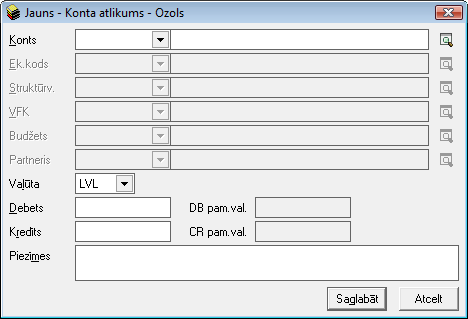
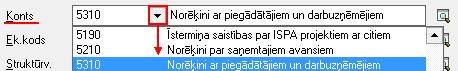
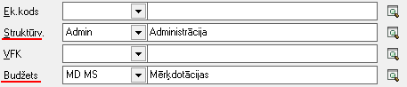
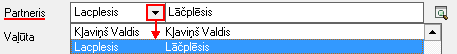
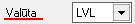
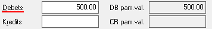
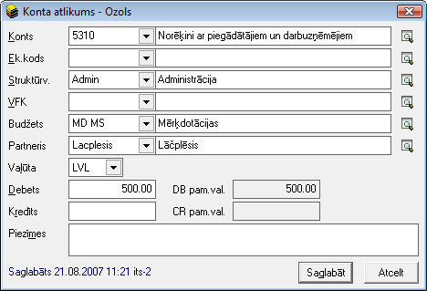

.. 146
 
Kontu atlikumi
******************
 


Kontu atlikumu sarakstā tiek saglabāti grāmatvedības kontu atlikumi
uzskaites perioda sākumā. Kontu atlikumi jāpievieno vienreiz, uzsākot
darbu ar grāmatvedības sistēmu, un atlikumiem sistēmā netiek noteikts
konkrēts datums. Kontu atlikumus var dalīt pa valūtām, analītikām,
struktūrvienībām, finanšu (EK) kodiem un citām datu uzskaites
dimensijām. Lai sadalītu konta atlikumu pa analītikām, sarakstā vienam
kontam pievieno atsevišķas summas, norādot to piederību kādai no datu
uzskaites dimensijām. Kontu atlikumi tiek izmantoti grāmatvedības
atskaišu sastādīšanā.


Jauna konta atlikuma pievienošana
`````````````````````````````````

Lai kontu atlikumu sarakstā pievienotu jaunu grāmatvedības konta
atlikumu uzskaites perioda sākumā, rīku joslājānospiež poga
|images_ozols/24708.png| un tiks atvērts jauns logs:


|images_ozols/25084.png|


1. Nepieciešams norādīt attiecīgo grāmatvedības kontu no konta plāna,
kuram konta atlikums uz perioda sākumu tiks ievadīts:


|images_ozols/25086.png|


2. Konta atlikumus iespējams dalīt pa dažādām datu uzskaites
dimensijām. Ja izvēlētajam kontam sākuma atlikumu nepieciešams dalīt
pa dimensijām (EK kodu, budžetu, Projektu, u.c. dimensijas), tad konta
atlikuma aprakstā, jānorāda nepieciešamās dimensijas (visi dimensiju
lauki NAV jāaizpilda obligāti, nepieciešams norādīt tikai tās
dimensijas, kādā griezumā konta sākuma atlikums jāsadala):


|images_ozols/25087.png|


3. Ja kontam tiek izmantota analītiskā uzskaite (Partneris), tad arī
konta sākuma atlikumam nepieciešams norādīt analītiku - Partneri,
izvēloties to no :doc:`Partneru saraksta<112>` :


|images_ozols/25088.png|


4. Jānorāda konta sākuma atlikuma valūta:


|images_ozols/25089.png|


5. Nepieciešams ievadīt izvēlētā grāmatvediskā konta sākuma atlikuma
summu debetā vai kredītā (ja konta sākuma atlikuma valūta būs izvēlēta
atšķirīga no noteiktās pamatvalūtas, laukos DB pam.val un CR pam.va.
ievadītā summa automātiski tiks pārrēķināta pamatvalūtā pēc LB
noteiktā valūtas kursa):


|images_ozols/25090.png|


Kad visi nepieciešamie lauki ir aizpildīti, lai saglabātu jaunu konta
sākuma atlikuma ierakstu, nepieciešams nospiest pogu
|images_ozols/24615.jpg| .


Pievienotā konta sākuma atlikumalabošana:
`````````````````````````````````````````

Lai veiktu labojumus pievienotajākonta atlikuma aprakstā, ierakstu
nepieciešams atvērt, izmantojot rīku joslas pogu
|images_ozols/24709.png| (ALT+A), unatvērtajāierakstā iespējams
veiktnepieciešamos labojumus (mainot datu uzskaites dimensijas,
analītiku vai sākuma atlikuma summu):


|images_ozols/25091.png|


Pēc labojumu veikšanas, veiktā izmaiņas iespējams
|images_ozols/24615.jpg| vai |images_ozols/24617.jpg| .

.. |images_ozols/24708.png| image:: images_ozols/24708.png
       :scale: 100%













.. |images_ozols/24615.jpg| image:: images_ozols/24615.jpg
       :scale: 100%

.. |images_ozols/24709.png| image:: images_ozols/24709.png
       :scale: 100%



.. |images_ozols/24615.jpg| image:: images_ozols/24615.jpg
       :scale: 100%

.. |images_ozols/24617.jpg| image:: images_ozols/24617.jpg
       :scale: 100%


 
