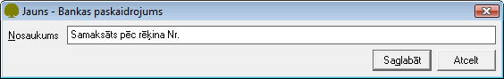

.. 147
 
Bankas paskaidrojumu saraksts
*********************************
 

Bankas paskaidrojumi ir saraksts, kurā tiek saglabāti biežāk
izmantotie maksājuma mērķu teksti :doc:`Bankas maksājuma
uzdevumos<347>` . Paskaidrojumu saraksta dati tiek izmantoti maksājuma
uzdevuma lauka Mērķis automatizētai aizpildīšanai.

Jauna Bankas paskaidrojumu sarakstapievienošana:
++++++++++++++++++++++++++++++++++++++++++++++++

Lai pievienotu jaunuBankas paskaidrojumu sarakstu,jānospiež poga
|images_ozols/24708.png| un tiks atvērts jauns logs:

|images_ozols/24658.jpg|

Laukā Nosaukums, nepieciešams ierakstīt Bankas paskaidrojuma
nosaukumu. Ieraksts tiks saglabāts, izpildot komandu
|images_ozols/24615.jpg| .

Pievienotā Bankaspaskaidrojumu sarakstalabošana:
++++++++++++++++++++++++++++++++++++++++++++++++

Lai veiktu labojumus pievienotajā ierakstā, ierakstu nepieciešams
atvērt, izmantojot rīku joslas pogu |images_ozols/24709.png| (ALT+A),
unatvērtajā logā nomainīt Nosaukumu.

Pēc labojumu veikšanas, veiktā izmaiņas iespējams
|images_ozols/24615.jpg| vai |images_ozols/24617.jpg| .

.. |images_ozols/24708.png| image:: images_ozols/24708.png
       :scale: 100%

.. |images_ozols/24615.jpg| image:: images_ozols/24615.jpg
       :scale: 100%

.. |images_ozols/24709.png| image:: images_ozols/24709.png
       :scale: 100%

.. |images_ozols/24615.jpg| image:: images_ozols/24615.jpg
       :scale: 100%

.. |images_ozols/24617.jpg| image:: images_ozols/24617.jpg
       :scale: 100%


 
