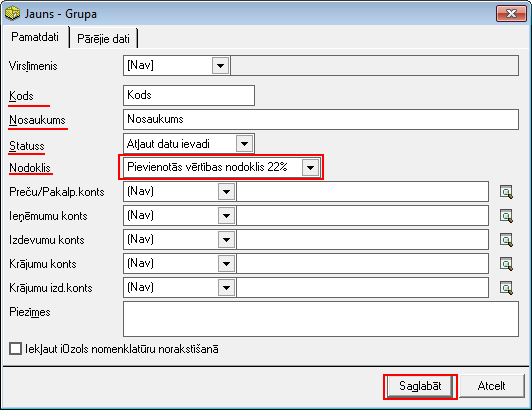

.. 148
 
Grupas
**********
 


Sarakstā tiek saglabātas grupas, kas tiek izmantotas, lai
krājumus/preces vai pakalpojumus grupētu, atbilstoši uzņēmumā
noteiktajai uzskaites sistēmai, kā arī saskaņā ar grāmatvedības
noteiktu dalījumu kontu griezumā. Grupa tiek norādīta pakalpojumu vai
nomenklatūras kartiņas aprakstā. Grupu sarakstu var izveidot
neierobežoti plašu un hierarhisku. Hierarhiskais grupu saraksts
nodrošina datu grupēšanu uz augstākajiem grupu saraksta līmeņiem.


Jaunas nomenklatūras grupas pievienošana
````````````````````````````````````````

Lai pievienotu jaunu nomenklatūras grupu, jāizmanto komanda
|images_ozols/24708.png| no rīku joslas (Alt+P) un tiks atvērts jauns
logs:


|images_ozols/26520.png|


Atvērtajā logā jāaizpilda nepieciešamie lauki:


Virslīmenis : jānorāda augstākais līmenis, zem kura šis ieraksts tiks
pievienots. Ja tāda nav, tad jānorāda izvēlne [NAV];

Kods: jānorāda grupas nosaukuma saīsinājums, kas dos iespēju iepirkuma
dokumentos ātrāk atrast nepieciešamo grupu:

Nosaukums : norāda grupas pilnu nosaukumu

Statuss : jānorāda statuss, vai dati uz šo ierakstu tiks vadīti, vai
nē (rekomendējams likt statusu "Aizliegt datu ievadi", ja šī grupa
tiks izmantota kā augstākā līmeņa un kalpos datu apvienošanai);


Nodoklis : jānorāda kāda nodokļa likmenorēķina dokumentā būs
konkrētajai nomenklatūras grupai.


|images_ozols/24545.gif| Uzņēmuma grāmatvedim laukos, kas paredzēti
grāmatvedisko kontu ievadei, iespējams norādīt katrai grupai
atbilstošos uzskaites, izdevumu un ieņēmumu kontus.


Jaunizveidotais grupas ieraksts tiks saglabāts pēc komandas
|images_ozols/24867.png| aktivizēšanas.


Lai veiktu izmaiņas jaunizveidotajā nomenklatūras grupā, ieraksts ir
jāatver ar komandu |images_ozols/24869.png| no rīku joslas un jāveic
izmaiņas. Lai saglabātu veiktās izmaiņas ir jāizmanto komandu
|images_ozols/24867.png| no rīku joslas.


Lai dzēstu nomenklatūras grupu ir jāizmanto komanda
|images_ozols/25602.png| . Dzēšot nomenklatūras grupas ieraksts nav
jāatver.

.. |images_ozols/24708.png| image:: images_ozols/24708.png
       :scale: 100%



.. |images_ozols/24545.gif| image:: images_ozols/24545.gif
       :scale: 100%


.. |images_ozols/24869.png| image:: images_ozols/24869.png
       :scale: 100%


.. |images_ozols/25602.png| image:: images_ozols/25602.png
       :scale: 100%


 
