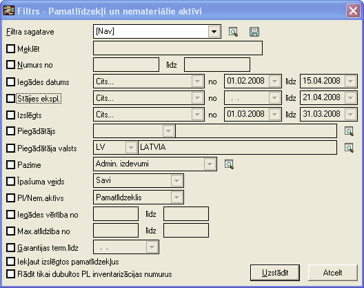

.. 151
 
Pamatlīdzekļi un nemateriālie aktīvi
****************************************
 
Pamatlīdzekļu un nemateriālo aktīvu žurnālā tiek parādīta informācija
par visiem uzņēmuma pamatlīdzekļiem. Atverot pamatlīdzekli vai
nemateriālo aktīvu, ir iespējams redzēt visas darbības, kuras veiktas
ar šo pamatlīdzekli vai nemateriālo aktīvu.

Izmantojot Rīku joslā pogu |images_ozols/24535.gif| , tiek atvērts
filtra logs:

|images_ozols/25499.png|

Ar filtru iespējams atlasīt pamatlīdzekļus un nemateriālos aktīvus:

Meklēt: iespējams izvērsti meklēt pamatlīdzekļus vai nemateriālos
aktīvus pēc dažādiem kritērijiem (Piem., skapis- tiks atlasīti visi
pamatlīdzekļi, kuriem nosaukumā ir vārds skapis);

Numurs no ... līdz ...: iespējams atlasīt pamatlīdzekļus vai
nemateriālos aktīvus no noteikta inventāra numura līdz noteiktam
numuram, vai arī tikai pēc viena numura;

Iegādes datums: pēc iegādes datuma;

Stājies ekspl.: pēc stāšanās ekspluatācijā datuma;

Izslēgts: pēc izslēgšanas datuma;

Piegādātājs: atlasīt pēc pamatlīdzekļa un/vai nemateriālā aktīva
piegādātāja;

Piegādātāja valsts: pēc piegādātāja valsts;

Piezīme: dažādas piezīmes (piem., Admin. izdevumi);

Īpašuma veids: pēc īpašuma veida (piem., Savi);

Pl/Nem.aktīvs: iespējams atlasīt tikai pamatlīdzekļus vai nemateriālos
aktīvus;

Iegādes vērtība no ... līdz ...: iegādes vērtība;

Max.atlīdzība no ... līdz ...: apdrošināšanas atlīdzības vērtība;

Garantijas term.līdz: garantijas termiņš;

Iekļaut izslēgtos pamatlīdzekļus: iespējams atlasīta arī izslēgtos
pamatlīdzekļus;

Rādīt tikai dubultos PL inventarizācijas numurus: atlasīt tikai tos
pamatlīdzekļus, kuriem ir dubultie inventarizācijas numuri.

Norādot visus atlasīšanas kritērijus, jānospiež poga
|images_ozols/25379.png| .

.. |images_ozols/24535.gif| image:: images_ozols/24535.gif
       :scale: 100%

.. |images_ozols/25379.png| image:: images_ozols/25379.png
       :scale: 100%


 
