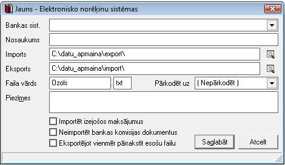
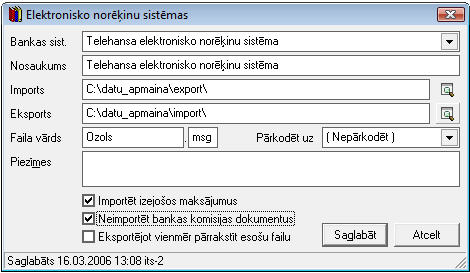

.. 160
 
Bankas elektronisko norēķinu sistēmas
*****************************************
 


Šajā sarakstā iespējams pievienot nepieciešamās norēķinu sistēmas.
Norēķinu sistēmas aprakstā jānorāda ceļš uz katalogiem, kuri tiek
izmantoti datu apmaiņai starp grāmatvedības sistēmu un bankas norēķinu
sistēmu.


Jaunas Elektronisko norēķinu sistēmas pievienošana:
```````````````````````````````````````````````````

Lai pievienotu jaunu elektronisko norēķinu sistēmu jānospiež poga
|images_ozols/24708.png| un tiks atvērts jauns logs:


|images_ozols/24581.jpg|


Nepieciešams izvēlēties atbilstošo bankas sistēmu no saraksta:


|images_ozols/24584.jpg|


Jānorāda "ceļš" importa un eksporta katalogam:


|images_ozols/24583.jpg|


Papildiespēju atzīmēšana Elektronisko norēķinu sistēmai:
````````````````````````````````````````````````````````

|images_ozols/24588.jpg|

Atzīmējot šo izvēles rūtiņu, būs iespējams importēt visus programmā
sagatavotos izejošos maksājumus - :doc:`Bankas izdevumu
dokumentus<224>` , kuriem :doc:`Bankas maksājuma uzdevumā<347>` būs
atzīmēta pazīme "Eksportēt uz bankas elektronisko norēķinu sistēmu".


|images_ozols/24589.jpg|

Atzīmējot šo izvēles rūtiņu, iespēja no elektronisko norēķinu
sistēmasneimportēt programmā bankas komisijas dokumentus. Šo iespēju
ieteicams atzīmēt, jašodokumentu apjoms ir liels un tādēļ nevēlaties
bankas komisijas dokumentus importēt sistēmā automātiski kā atsevišķus
dokumentus.


|images_ozols/24590.jpg|

Atzīmējot šo izvēles rūtiņu, eksportējot bankas izdevumu dokumentus,
iepriekš sagatavotais fails tiks pārrakstīts (dzēsts) un aizstāts ar
jaunizveidoto failu.


Kad visi nepieciešamie lauki ir aizpildīti, lai saglabātu Elektronisko
norēķinu sistēmu, nepieciešams nospiest pogu |images_ozols/24615.jpg|
.


PievienotāsElektronisko norēķinu sistēmas labošana:
```````````````````````````````````````````````````

Lai veiktu labojumus pievienotajā Elektronisko norēķinu sistēmā,
ierakstu nepieciešams atvērt, izmantojot rīku joslas pogu
|images_ozols/24709.png| (ALT+A), unatvērtajā logā iespējams
veiktnepieciešamos labojumus:

|images_ozols/24616.jpg|

Pēc labojumu veikšanas, veiktā izmaiņas iespējams
|images_ozols/24615.jpg| vai |images_ozols/24617.jpg| .

.. |images_ozols/24708.png| image:: images_ozols/24708.png
       :scale: 100%



.. |images_ozols/24584.jpg| image:: images_ozols/24584.jpg
       :scale: 100%

.. |images_ozols/24583.jpg| image:: images_ozols/24583.jpg
       :scale: 100%


.. |images_ozols/24589.jpg| image:: images_ozols/24589.jpg
       :scale: 100%

.. |images_ozols/24590.jpg| image:: images_ozols/24590.jpg
       :scale: 100%

.. |images_ozols/24615.jpg| image:: images_ozols/24615.jpg
       :scale: 100%

.. |images_ozols/24709.png| image:: images_ozols/24709.png
       :scale: 100%



.. |images_ozols/24615.jpg| image:: images_ozols/24615.jpg
       :scale: 100%

.. |images_ozols/24617.jpg| image:: images_ozols/24617.jpg
       :scale: 100%


 
