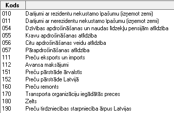

.. 170
 
========================
Ārējo maksājumu kodi
========================
 
Klasifikators ir :doc:`Latvijas bankas apstiprināts` ārējo maksājumu
saraksts. Katram ārējā maksājuma mērķim tiek piešķirts trīsciparu
maksājuma kods, atbilstoši maksājumu bilances starptautiskajiem
standartiem.

|images_ozols/26456.png|

Ārējo maksājumu klasifikators tiek lietots, lai veiktu pārskaitījumus
saņēmējam, kurš nav rezidents, par summu kas lielāka kā 1000.00 LVL.
Kopā ar ārējā maksājuma kodu būs jāievada arī saņēmēja valsts kods.


 
