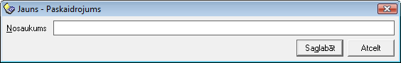

.. 177
 
Paskaidrojumi
*****************
 
Avansu paskaidrojumi ir saraksts, kurā tiek saglabāti biežāk
izmantotie Avansa norēķina Virsraksta paskaidrojuma teksti.
Paskaidrojumu saraksta dati tiek izmantoti Avansa norēķina dokumenta
lauka Paskaidrojums automatizētai aizpildīšanai (Avansa norēķina
izdrukā lauks - Avansa norēķina mērķis).

JaunaAvansa paskaidrojumu sarakstapievienošana:
+++++++++++++++++++++++++++++++++++++++++++++++

Lai pievienotu jaunuAvansa paskaidrojumu sarakstā,jānospiež poga
|images_ozols/24708.png| un tiks atvērts jauns logs:

|images_ozols/25248.png|

Laukā Nosaukums, nepieciešams ierakstītAvansa paskaidrojuma nosaukumu.
Ieraksts tiks saglabāts, izpildot komandu |images_ozols/24615.jpg| .

PievienotāAvansapaskaidrojumalabošana:
++++++++++++++++++++++++++++++++++++++

Lai veiktu labojumus pievienotajā ierakstā, ierakstu nepieciešams
atvērt, izmantojot rīku joslas pogu |images_ozols/24709.png| (ALT+A),
unatvērtajā logā nomainīt Nosaukumu.

Pēc labojumu veikšanas, veiktā izmaiņas iespējams
|images_ozols/24615.jpg| vai |images_ozols/24617.jpg| .

.. |images_ozols/24708.png| image:: images_ozols/24708.png
       :scale: 100%

.. |images_ozols/24615.jpg| image:: images_ozols/24615.jpg
       :scale: 100%

.. |images_ozols/24709.png| image:: images_ozols/24709.png
       :scale: 100%

.. |images_ozols/24615.jpg| image:: images_ozols/24615.jpg
       :scale: 100%

.. |images_ozols/24617.jpg| image:: images_ozols/24617.jpg
       :scale: 100%


 
