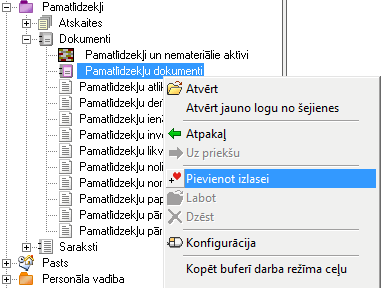

.. 18
 
Mani darbi
==============
 

Katalogs Mani darbi ir paredzēts biežāk lietoto darba režīmu
apkopošanai un parādīšanai vienā katalogā. Katalogu Mani darbi
lietotājs var izveidot patstāvīgi, izmantojot pārlūku.

|images_ozols/25277.png|

Lai pievienotu darba režīmu katalogam mani darbi, pārlūkā ar peles
labo pogu jāuzklikšķina uz darba režīma un jāizvēlas komanda Pievienot
izlasei. Tiks atvērta ekrāna forma, kur jālieto komanda Pievienot.
Pārlūkā tiks izveidota jauna sadaļa mani darbi, kur parādīsies
pievienotais darba režīms.

Katalogu Mani darbi vienmēr var izsaukt, lietojot taustiņu F2 .


 
