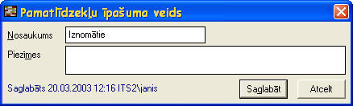

.. 183
 
Pamatlīdzekļu īpašuma veidi
*******************************
 
Pamatlīdzekļu īpašuma veidu sarakstā jānodefinē uzņēmumā izmantotie
pamatlīdzekļu īpašumu veidi (piem. Savi , Nomātie , Iznomātie , utt.).
Šis saraksts (klasifikators) strādājot ar pamatlīdzekļu moduli nav
obligāti jāizmanto. Ņemot uzskaitē jaunus pamatlīdzekļus vai
pievienojot pamatlīdzekļu sākuma atlikumus katru pamatlīdzekli
iespējams nodefinēt pie kāda no uzņēmumā izmantotā pamatlīdzekļu
īpašuma veida. Pamatlīdzekļu atskaišu sagatavošanā
pamatlīdzekļuīpašuma veidu ir iespējams izmantot kā datu
(pamatīdzekļu)atlases nosacījumu, piem. atlasot tikai Dāvinātos
pamatlīdzekļus.

Jauns pamatlīdzekļu īpašuma veidstiek pievienots pamatlīdzekļu īpašumu
veidu sarakstā ar funkciju .. image:: images_ozols/24532.jpg
:scale: 100%
. Pēc nepieciešamās informācijas aizpildīšanas jāspiež poga Saglabāt
lai saglabātu jaunizveidoto ierakstu.

:scale: 100%

Pamatlīdzekļa īpašuma veidu labo ar funkciju .. image::
images_ozols/24533.jpg
:scale: 100%
.

Pamatlīdzekļu īpašuma veidu dzēš ar funkciju .. image::
images_ozols/24534.jpg
:scale: 100%
. Pamatlīdzekļu īpašuma veidu sistēma neļauj dzēst, ja tas ir
pievienots kādam sistēmā ievadītam pamatlīdzeklim.


 
