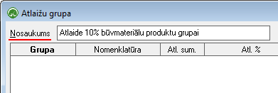
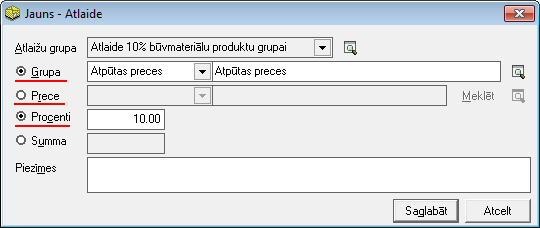

.. 185
 
Atlaižu grupas
******************
 
Sarakstā tiek saglabātas atlaižu grupas, kas tiek izmantotas norēķinu
dokumentos un piešķirtas konkrētiem partneriem :doc:`<106>` .
Iespējams izveidot neierobežotu daudzumu atlaižu grupas, kurus
iespējams piesaistīt partneriem, norādot atbilstošo noklusēto atlaižu
grupu :doc:`Partnera apraksta<312>` sadaļā "Pārējie dati", lai tādā
veidā atšķirīgām pircēju grupām varētu definēt atšķirīgas atlaižu
grupas.


Jaunas Atlaižu grupas pievienošana
``````````````````````````````````

Lai pievienotu jaunu Atlaižu grupu,rīku joslā jānospiež poga
|images_ozols/24708.png| un tiks atvērts jauns logs:


|images_ozols/26504.png|


Nosaukums: Jāpiešķir atlaižu grupas nosaukums (piemēram, atlaides
grupa konkrētai precei vai preču grupai)


Izmantojot pogu |images_ozols/24708.png| , atlaižu grupai iespējams
definēt, kurām precēm vai preču grupām atlaide tiks piešķirta:


|images_ozols/26505.png|


**Atlaižu grupa:** lauks automātiski tiek aizpildīts no pievienotās
atlaižu grupas nosaukuma lauka;

**Grupa: **no :doc:`Grupu<148>` saraksta iespējams izvēlēties preču
vai pakalpojumu grupu, kurai atlaide tiks piemērota;

**Prece:** neizvēloties grupu, iespējams definēt atlaidi arī konkrētai
:doc:`precei<106>` - no preču saraksta iespējams izvēlēties konkrētu
preci, kurai atlaide tiks piemērota;


**Procenti:** nepieciešams ievadīt atlaides procentu


Ieraksts tiks saglabāts, izpildot komandu |images_ozols/24710.png| .

.. |images_ozols/24708.png| image:: images_ozols/24708.png
       :scale: 100%



.. |images_ozols/24708.png| image:: images_ozols/24708.png
       :scale: 100%



.. |images_ozols/24710.png| image:: images_ozols/24710.png
       :scale: 100%


 
