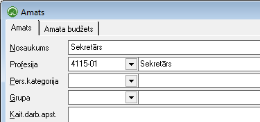

.. 186
 
Amati
*********
 

Amatu sarakstā jānodefinē uzņēmuma amats, jāpievieno profesija no
:doc:`Profesiju klasifikatora<128>` , kā arī iespējams amatam
piesaistīt - :doc:`Personāla kategoriju<127>` , :doc:`Amatu
grupu<959>` , aizpildīt informāciju brīvajos teksta laukos par
kaitīgiem vai īpašiem darba apstākļiem, norādīt nepieciešamo veselības
pārbaužu skaitu, atzīmēt pazīmi par sanitārās grāmatiņas
nepieciešamību, kā arī ievadīt amata aprakstu.

Amatu saraksts tiek lietots pievienojot jaunu :doc:`slodzi<207>` .
Katram amatam iespējams pievienot budžetu un amata skaitu uz noteiktu
periodu.

Amatu saraksts ir jāizmanto pēc principa, ka vienam un tam pašam
amatam uzņēmumā tiek piešķirts viens un tas pats profesijas kods un
amata apraksts. Uzņēmumā vienā amatā var strādāt vairāki cilvēki.

|images_ozols/25604.png|

Lai pievienotu jaunu amatu, rīku joslā jānospiež poga
|images_ozols/24708.png| (Atl+P), tiek atvērts logs:

|images_ozols/26405.png|

Nosaukums: amata nosaukums;

Profesija: no :doc:`Profesiju klasifikatora<128>` jāizvēlas
attiecīgais kods.

Pers.kategorija: no :doc:`Personāla kategoriju<127>` klasifikatora
jāizvēlas attiecīgais kods;

Grupa: no :doc:`Amatu grupu<959>` saraksta jāizvēlas nepieciešamā
amata grupa

Amata aprakstā iespējams norādīt, cik uzņēmumā ir paredzētas amata
štata vietas. To skaits pa algu aprēķina periodiem var mainīties.

|images_ozols/24545.gif| Štata vietu skaits jāpievieno periodā, kad
tas ir mainījies. Piemēram, uz 2007. gada janvāri tiek noteikta 1
štata vieta, bet uz 2008. gada janvāri - 2 štata vietas. Ieraksti
jāpievieno periodā, kad notiek amatu skaita izmaiņas. Amata aprakstā
pievienojot štata vietu skaitu un slodzes aprakstā norādot strādājošā
ieņemamo amatu, tiek gatavotas atskaites :doc:`Štatu saraksta
aizpildījums<608>` un :doc:`Štatu saraksta aizpildījumu
kopsavilkums<609>` .

Amata budžeta sadaļā, iespējams izveidot štata vietu skaitu,
sadalījumā pa struktūrvienībām.Izvēlētā struktūrvienība amata aprakstā
atskaitēs parādīs, kurā struktūrvienībā ir neaizpildītas štata vietas.
Nospiežot pogu |images_ozols/24708.png| (Alt+P), jāizvēlas periods un
amatu skaits.

|images_ozols/25600.png|

Ar pogu |images_ozols/24708.png| (Alt+P), jāpievieno budžeta summa uz
attiecīgo periodu.

|images_ozols/25601.png|

Lai ierakstus atvērtu un labotu, vai dzēstu, jānospiež poga
|images_ozols/25603.png| (Alt+A) vai |images_ozols/25602.png| (Alt+D).
Lai saglabātu pievienotos datus, jānospiež poga
|images_ozols/24615.jpg| .

.. |images_ozols/25604.png| image:: images_ozols/25604.png
       :scale: 100%

.. |images_ozols/24708.png| image:: images_ozols/24708.png
       :scale: 100%

.. |images_ozols/24545.gif| image:: images_ozols/24545.gif
       :scale: 100%

.. |images_ozols/24708.png| image:: images_ozols/24708.png
       :scale: 100%

.. |images_ozols/25600.png| image:: images_ozols/25600.png
       :scale: 100%

.. |images_ozols/24708.png| image:: images_ozols/24708.png
       :scale: 100%

.. |images_ozols/25602.png| image:: images_ozols/25602.png
       :scale: 100%

.. |images_ozols/24615.jpg| image:: images_ozols/24615.jpg
       :scale: 100%


 
