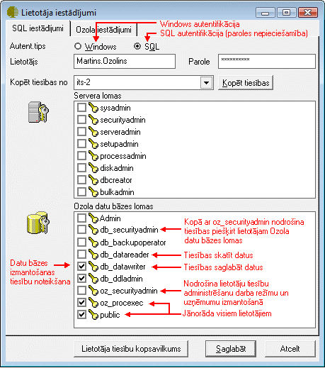

.. 194
 
Lietotāju saraksts
**********************
 
Lai pievienotu jaunu Lietotāju, rīku joslā jānospiež poga
|images_ozols/25605.png| , tiks atvērts Lietotāja iestādījumu logs:

|images_ozols/25761.png|

1.Jāpievieno lietotāja vārds

2.Jānorāda, vai tiks izmantota Windows vai SQL autentifikācijas tips
|images_ozols/24545.gif| Windows autentifikāciju var izmantot, ja tiek
izmantots domēns. Izmantojot Windows autentifikāciju, lietotājs
sistēmā tiks identificēts pēc savas datortīkla paroles un papildus
paroles darbam ar grāmatvedības sistēmu nebūs vajadzīgas.
Citos gadījumos lietotājiem jānosaka SQL autentifikācijas tips un
jāpievieno lietotāja parole. Izmantojot SQL autentifikāciju,
lietotājiem jāizmanto administratora piešķirtais lietotāja vārds un
parole.

3. Jānorāda lietotāja tiesības izmantot datu bāzi
|images_ozols/24545.gif| Lietotājiem, kuriem nebūs administrēšanas
tiesību, jānorāda Ozola datu bāzes lomas public, db_datareader,
db_datawriter, oz_procexec . Šīs tiesības jānorāda arī citiem
lietotājiem, kuriem tiek noteiktas papildus administrēšanas tiesības.

|images_ozols/24545.gif| Lietotājiem, kuriem būs tiesības administrēt
lietotāju datus - noteikt lietotājiem pieejamos :doc:`darba
režīmus<169>` , noteikt lietotājiem pieejamos :doc:`uzņēmumus<190>` ,
papildus jāaktivizē Ozola datu bāzes loma oz_securityadmin .
Lietotājiem, kuriem būs tiesības veikt izmaiņas :doc:`Lietotāju
sarakstā<194>` ,papildus jābūt ieliktām tiesībām oz_securityadmin un
db_securityadmin . Šādiem lietotājiem jābūt noteiktai servera lomai
sysadmin .

.. |images_ozols/25605.png| image:: images_ozols/25605.png
       :scale: 100%

.. |images_ozols/24545.gif| image:: images_ozols/24545.gif
       :scale: 100%

.. |images_ozols/24545.gif| image:: images_ozols/24545.gif
       :scale: 100%

.. |images_ozols/24545.gif| image:: images_ozols/24545.gif
       :scale: 100%


 
