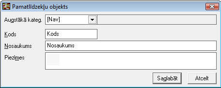

.. 202
 
Pamatlīdzekļu objekti
*************************
 

Pamatlīdzekļu objektu sarakstā jānodefinē uzņēmumā izmantotie
pamatlīdzekļu objekti. Pamatlīdzekļu objektus var izmantot lai
uzskaitītu pamatlīdzekļus pa detalizētākām atrašanās vietām, piem. pa
uzņēmuma nodaļām, telpām vai citām uzņēmumā noteiktām vienībām.
Pievienojot jaunus pamatlīdzekļus pamatlīdzekļa objekta lauks ir
jāaizpilda obligāti. Uzņēmumiem, kas uzņēmuma uzskaites vajadzībām
neizmanto šo klasifikatoru, jāizveido šajā klasifikatorā vismaz viens
ieraksts (piem. [Nenoteikts] vai [Viss uzņēmums] ) un vienmēr šis
ieraksts jāizmanto pievienojot jaunus pamatlīdzekļus. Pamatlīdzekļu
atskaišu sagatavošanā pamatlīdzekļu objektus ir iespējams izmantot kā
datu (pamatlīdzekļu) atlases nosacījumu.

Jaunu pamatlīdzekļa objektu pievieno pamatlīdzekļu objektu sarakstā ar
funkciju |images_ozols/25605.png| . Pēc nepieciešamās informācijas
aizpildīšanas jāspiež poga Saglabāt lai saglabātu jaunizveidoto
ierakstu.

Pamatlīdzekļu objektu klasifikators ir hierarhisks un pievienojot
jaunu objektu laukā Augstākā kateg. jānorāda kāds ir jaunā ieraksta
augstākais līmenis. Ja jaunajam ierakstam nav augstākā līmeņa un
jaunais ieraksts ir virsējais līmenis, tad laukā Augstākā kateg.
jānorāda vērtība [Nav] .

Sistēmā strādājot ar vairākiem uzņēmumiem papildus laukā Uzņēmums
jānorāda uzņēmums, kurš jauno pamatlīdzekļu objektu izmantos, vai
jānorāda vērtība (Visas) , jašo pamatlīdzekļu objektu izmantos visi
datu bāzē izveidotie uzņēmumi.

|images_ozols/26436.png|

Pamatlīdzekļa objektu labo ar funkciju |images_ozols/25603.png| .

Pamatlīdzekļa objektu dzēš ar funkciju |images_ozols/25602.png| .
Pamatlīdzekļa objektu sistēma neļauj dzēst, ja tas ir pievienots kādam
sistēmā ievadītam pamatlīdzeklim.

.. |images_ozols/25605.png| image:: images_ozols/25605.png
       :scale: 100%

.. |images_ozols/25603.png| image:: images_ozols/25603.png
       :scale: 100%

.. |images_ozols/25602.png| image:: images_ozols/25602.png
       :scale: 100%


 
