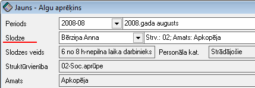

.. 212
 
Algu aprēķinu žurnāls
*************************
 

Algu aprēķinu žurnālā tiek parādīti visi izveidotie algu aprēķini.
Vienai :doc:`Slodzei<207>` katrā aprēķina periodā tiek izveidots viens
ieraksts.

Lai atlasītu dokumentus, jāizmanto datu atlases filtrs. Datus var
parādīt tikai vienam aprēķina periodam, tikai vienai struktūrvienībai,
atlasīt algu aprēķinus tikai vienai personai, vienam amatam, slodzes
veidam, personas kategorijai vai ienākumu un sociālā nodokļa metodēm.
Dati uz ekrāna tiek parādīti atbilstoši norādītajiem datu atlases
kritērijiem filtra ekrāna formā. Rīku joslā nopiežot pogu
|images_ozols/24535.gif| (Ctrl+F), tiek atvērts filtra logs:

|images_ozols/26122.png|

Aprēķina periods. : datus iespējams atlasīt tikai vienam :doc:`Algu
aprēķina periodam<211>`

Persona: atlasīt algu aprēķinus tikai vienai personai;

Struktūrv.: datus iespējams atlasīt tikai par vienu struktūrvienību;

Amats : atlasīt algu aprēķinus tikai par vienā konkrētā amatā
strādājošajiem;

Slodzes veids: atlasīt datus pēc slodzes veida;

Pers.kategorija: datus iespējams atlasīt par konkrētu personāla
kategoriju;

Ien.nod.met.: atlasīt algu aprēķinus pēc izvēlētās ienākuma nodokļa
metodes;

Soc.nod.met.: atlasīt algu aprēķinus pēc izvēlētāssociālā nodokļa
metodes;

Lai Dokumentu žurnālā datus atlasītu pēc izvēlētajiem datu atlases
kritērijiem, pēc filtra iestādījumu aizpildīšanas, jānospiež poga
|images_ozols/25944.png| .

|images_ozols/24545.gif| Tikai aktīvajā algu aprēķina periodā
iespējams labot aprēķina datus, pārējo periodu aprēķini ir pieejami
tikai apskates režīmā.

|images_ozols/24545.gif| Ar algu aprēķiniem saistītās instrukcijas:
+++++++++++++++++++++++++++++++++++++++++++++++++++++++++++++++++++

+ :doc:`Algu aprēķinu veikšanas shēma<14111>`
+ :doc:`Algu aprēķinā iebūvētās komandas<14114>`
+ :doc:`Nodokļu dokumenta datu piemērošana algu aprēķinā<14113>`
+ :doc:`Rīkojumu nosacījumu pievienošana strādājošā algu
aprēķinam<14127>`
+ :doc:`Atvaļinājuma naudas aprēķins<14128>`
+ :doc:`Atvaļinājuma naudas aprēķins nākamajiem
periodiem/papildperiodiem<14130>`
+ :doc:`Slimības naudas aprēķins<14129>`
+ :doc:`Avansu (starpmaksājumu) izmaksu sarakstu izveidošana<14115>`

Algu aprēķinupievienošana
+++++++++++++++++++++++++

Veicot algu aprēķinu, vispirms ir :doc:`jāatver atbilstošais algu
aprēķina periods<499>` un tajā jāpievieno algu aprēķina ieraksti.
Jauns algu aprēķins tiek pievienots,rīku joslānospiežot pogu
|images_ozols/24708.png| un izvēloties atbilstošo slodzi, kurai tiks
veikts algas aprēķins:

|images_ozols/26123.png|

Algas aprēķins:
+++++++++++++++

1. Jāatver algu aprēķins.

|images_ozols/24545.gif| Algu aprēķina darba režīma kreisajā pusē tiek
pievienota aprēķinātā alga, prēmijas, piemaksas, ieturējumi, kavētās
darba dienas u.tml., atkarībā no algu konfigurācijas. Labajā pusē tiek
parādīti algu aprēķina rezultāti.

Algu aprēķina ekrāna formai ir rīku josla, kur var aktivizēt komandu
algu aprēķinam, izsaukt algu aprēķina rezultātus, perioda datus,
slodzes nodokļu dokumentus, rīkojumus, algu lapiņu. Ar bultām var
saglabāt atvērto un atvērt jaunu algu aprēķina darba režīmu nākamajam
strādājošajam:

|images_ozols/26124.png|

|images_ozols/24545.gif| :doc:`Algu aprēķinā iebūvētās
komandas<14114>`

2. Lai veiktu algu aprēķinu, nepieciešams:

+ Ielādēt datus no :doc:`Algu tarifikācijas<728>` (nospiežot algu
aprēķina ekrāna formas rīku joslas 4 pogu)
+ Ielādēt datus no slodzes kalendāra (dati no :doc:`Rīkojumu
žurnālā<209>` reģistrētajiem rīkojumiem) (nospiežot algu aprēķina
ekrāna formas rīku joslas3 pogu): :doc:`Rīkojumu nosacījumu
pievienošana strādājošā algu aprēķinam<14127>`
+ Ja nepieciešams algu aprēķinā pievienot papildus ieejošos kodus, kas
  attiecas tikai uz konkrētā mēneša algas aprēķinu un iepriekš nav
  bijuši definēti algu tarifikācijā, to iespējams izdarīt manuāli
  pievienojot vēlamo ieejošo kodu. Ieejošo datu apstrādei jālieto
  komandas Pievienot, Atvērt, Dzēst. Pievienojot jaunu maksājumu
  jāizvēlas maksājuma veids un maksājuma kods. Jāpievieno aprēķinātā
  vērtība:

|images_ozols/26332.png|

Ieejošo kodu izvēle atkarīga no algu aprēķina :doc:`Ieejošo kodu
konfigurācijas<282>` . Ieejošie kodi var būt arī kavētās darba dienas,
atvaļinājuma dienas, piemaksas, prēmijas, ieturējumi,u.tml..

+ Kad ieejošie kodi ir pievienoti, labajā darba režīma labajā pusē
tiek aprēķināti algu rezultāti. Ar peles dubultklikšķi ekrāna formas
labajā pusē var atvērt rezultātu sarakstu, kur redzami visi algu
aprēķinā noteiktie rezultāti.
+ Izmaksājamā summa tiek parādīta algu aprēķina formā un tā ir
  jānosūta uz izmaksu sarakstu, izmantojot komandu Uz izmaksu (F8) vai
  arī Algu Rīkus-> :doc:`Algu aprēķins<498>` : pēdējā izvēles rūtiņa:
  |images_ozols/26333.png| . Jābūt izveidotam :doc:`Izmaksu
  sarakstam<238>` . Ja summa tiek nosūtīta pirmo reizi uz izmaksu
  sarakstu, jānorāda, uz kuru izmaksu sarakstu summa jāsūta. Izmaksu
  saraksti tiek parādīti atbilstoši izvēlētajam maksājumam. Ja izmaksu
  sarakstā veids ir izmaksa bankā, tad, lai norādītu šo izmaksu
  sarakstu, maksājums ir jāizvēlas arī summas nosūtīšanas laikā. Kad
  izmaksu saraksts pirmo reizi ir norādīts, pārējiem strādājošiem tas
  tiek piedāvāts kā standarta saraksts izmaksu nosūtīšanai. Lai
  izvēlētos citu sarakstu, jālieto algu aprēķina rīko joslas komanda
  Izmaksa.

.. |images_ozols/24535.gif| image:: images_ozols/24535.gif
       :scale: 100%

.. |images_ozols/26122.png| image:: images_ozols/26122.png
       :scale: 100%

.. |images_ozols/25944.png| image:: images_ozols/25944.png
       :scale: 100%

.. |images_ozols/24545.gif| image:: images_ozols/24545.gif
       :scale: 100%

.. |images_ozols/24545.gif| image:: images_ozols/24545.gif
       :scale: 100%

.. |images_ozols/24708.png| image:: images_ozols/24708.png
       :scale: 100%

.. |images_ozols/24545.gif| image:: images_ozols/24545.gif
       :scale: 100%

.. |images_ozols/26124.png| image:: images_ozols/26124.png
       :scale: 100%

.. |images_ozols/24545.gif| image:: images_ozols/24545.gif
       :scale: 100%

.. |images_ozols/26332.png| image:: images_ozols/26332.png
       :scale: 100%

.. |images_ozols/26333.png| image:: images_ozols/26333.png
       :scale: 100%


 
