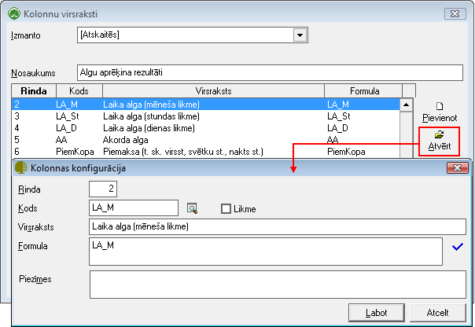
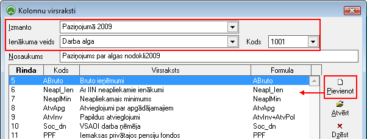

.. 214
 
Kolonnu virsraksti
**********************
 
Sarakstā Kolonnu virsraksti tiek nodefinētas algu atskaišu un vidējās
izpeļņas konfigurācijas.

Šīs konfigurācijas var izmantot veidojot algu atskaites:
:doc:`Dimensiju apgrozījums<680>` , :doc:`Rezultāti horizontāli<591>`
un :doc:`Rezultāti vertikāli<590>` , (algu atskaišu filtra laukā
Kolonnas norādot attiecīgo izveidoto konfigurāciju), kā arī tiek
izmantotas aprēķinot vidējās izpeļņas: Atvaļinājuma vid.dienas nauda,
Slimības vid.dienas nauda, Kompensācijas vid.dienas nauda.

Konfigurācija algu atskaitēm
++++++++++++++++++++++++++++

Konfigurācijas, kuras tiks izmantotas algu atskaitēs (piemēram,
:doc:`Rezultāti horizontāli<591>` ), kolonnu virsraksta aprakstā
norāda, ka šī konfigurācija tiks izmantota [Atskaitēs], piešķir
nosaukumu un pievieno nepieciešamās rindas, izmantojot pogu Pievienot.
Kolonnas konfigurācijā, izmantojot lupas pogu, nepieciešams norādīt
:doc:`algu rezultējošo kodu<283>` , balstoties uz kuru algu aprēķinos
aprēķinātā informācija tiks uzrādīta algu atskaitēs, norādītajā rindā
(kolonnā):

|images_ozols/26262.png|

Konfigurācija Paziņojumam par algas nodokli
+++++++++++++++++++++++++++++++++++++++++++

Pēc līdzīga principa iespējams sagatavot arī konfigurāciju
:doc:`Paziņojumam par algas nodokli<285>` . Lai sagatavotu
nepieciešamo konfigurāciju, nepieciešams izvēlēties veidu
[Paziņojumā], norādīt konfigurācijai atbilstošo ienākuma veidu no
saraksta (kas tiks uzrādīts :doc:`Paziņojuma<285>` Virsrakstā), kā arī
pievienot rindas, atbilstoši :doc:`Paziņojuma<285>` konfigurācijai,
norādot katrā rindā tos :doc:`algu rezultējošo kodus<283>` , kas
nepieciešami :doc:`Paziņojuma<285>` sagatavošanai:

|images_ozols/26263.png|


 
