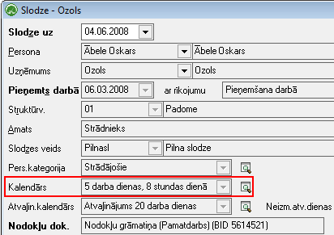
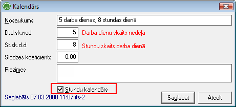

.. 218
 
Kalendāri
*************
 
Standarta kalendārs nosaka vērtības, kas ir kopīgas visiem uzņēmumā
strādājošajiem.

Kalendāru saraksts tiek izmantots veidojot. Strādājošo
:doc:`Slodzes<207>` :

|images_ozols/25608.png|

Standarta kalendārā tiek noteikts standarta darba dienu skaits nedēļā
un standarta stundu skaits dienā, piemēram, tiek noteikta 5 darba
dienu nedēļa ar 8 stundu darba dienu.
Standarta kalendārā tiek pieņemts, ja noteiktas 5 darba dienas, tad
sestdiena un svētdiena ir brīvdienas. Ja nosaka 6 dienu darba nedēļu,
tad brīvdiena ir svētdiena.
Lai pievienotu jaunu kalendāru, jānospiež Rīku joslā poga
|images_ozols/25605.png| , jāaizpilda lauki un jāsaglabā ieraksts.

|images_ozols/25609.png|

Stundu kalendārs: tiek ieķeksēts tad, ja strādājošajam algas
aprēķinstiekveikts balstoties uz nodefinēto stundas likmi.

.. |images_ozols/25605.png| image:: images_ozols/25605.png
       :scale: 100%


 
