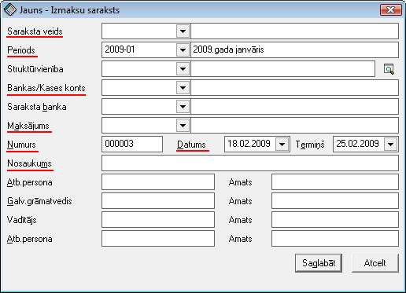

.. 238
 
Izmaksu sarakstu žurnāls
****************************
 

Izmaksu sarakstos tiek saglabātas algu vai avansu izmaksu summas, tos
var drukāt vai eksportēt datus uz banku elektronisko norēķinu sistēmu
noteiktā formātā.

Lai izveidotu un aizpildītu izmaksu sarakstu, izmaksu sarakstu žurnālā
jānospiež poga: |images_ozols/25605.png|

Tiks atvērts izmaksu saraksta virsraksts:

|images_ozols/26251.png|

Izmaksu saraksta virsraksts tiek izmantots saraksta izdrukāšanā un
izmaksājamo summu parādīšanā. Izmaksu sarakstā nepieciešams aizpildīt
šādus laukus:

Saraksta veids: Nepieciešams norādīt atbilstošo izmaksu saraksta veidu
- Avanss bankā/kasē; Alga bankā/kasē vai Starpizmaksa bankā/kasē

Periods: Nepieciešams norādīt atbilstošo algu aprēķinu periodu, par
kuru izmaksas tiek veidotas

Struktūrvienība: Nav obligāti aizpildāms. Aizpilda tikai gadījumos, ja
izmaksu sarakstus nepieciešams dalīt uzņēmuma struktūrvienību ietvaros

Bankas/Kases konts: Nepieciešams norādīt uzņēmuma bankas vai kases
kontu, no kura maksājums tiks veikts

Saraksta banka: Nepieciešams uzrādīt banku, kurai šis saraksts tiks
veidots - atbilstoši no algu aprēķiniem uz šo sarakstu būs iespējams
nosūtīt to strādājošo aprēķinātās algas, kur strādājošā bankas
privātkonts sakritīs ar izmaksu sarakstā norādīto. Gadījumā, ja tiek
izmantots kāds no bankas piedāvātajiem pakalpojumiem, kur tiek veidot
uz uzņēmumu viens saraksts un tālāk banka pati sadala pa komercbankām,
tad šajā gadījumā izmaksu sarakstā Saraksta banka NAV jānorāda.

Maksājums: Nepieciešams izvēlēties atbilstošo maksājumu - Alga, Avanss
vai Starpizmaksa

Numurs: Automātiski tiek piešķirts nākamais brīvais izmaksu saraksta
numurs pēc kārtas

Datums: Nepieciešams norādīt izmaksu saraksta datumu

Termiņš: Nepieciešams norādīt izmaksas termiņu

Nosaukums: Brīvā formā iespējams ievadīt izmaksu saraksta nosaukumu
(Piemēram, Algu izmaksa par janvāri)

Dati par atbildīgo personu, galveno grāmatvedi un uzņēmuma vadītāju
tiek ņemti no uzņēmuma aprakstā ievadītās informācijas. Ja
:doc:`Uzņēmuma informācijas<703>` visi lauki ir aizpildīti korketi,
tad arī šajā logā informācija aizpildīsies automātiski un nebūs jāvada
manuāli.

Pēc izmaksu saraksta aizpildīšanas, sarakstu nepieciešams saglabāt,
nospiežot pogu: |images_ozols/25621.png| .

|images_ozols/24545.gif| Kad no algu aprēķina izmaksājamās summas ir
nosūtītas uz izmaksu sarakstu, tad atverot izmaksu sarakstu, ir
redzams, ka tas ir aizpildīts. Ja nepieciešamas labot izmaksu saraksta
virsrakstu, jāizmanto komanda Funkcijas no atvērta dokumenta.
Jāapstiprina un jādrukā izmaksu saraksts.

|images_ozols/24545.gif| Instrukcija - :doc:`Izmaksu sarakstu eksports
uz banku elektronisko norēķinu sistēmām<14116>`

|images_ozols/24545.gif| Instrukcija - :doc:`Avansu (starpmaksājumu)
izmaksu sarakstu izveidošana<14115>`

.. |images_ozols/25605.png| image:: images_ozols/25605.png
       :scale: 100%

.. |images_ozols/25621.png| image:: images_ozols/25621.png
       :scale: 100%

.. |images_ozols/24545.gif| image:: images_ozols/24545.gif
       :scale: 100%

.. |images_ozols/24545.gif| image:: images_ozols/24545.gif
       :scale: 100%

.. |images_ozols/24545.gif| image:: images_ozols/24545.gif
       :scale: 100%


 
