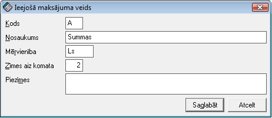

.. 279
 
Ieejošo kodu veidi
**********************
 

Šajā sarakstā tiek nodefinēti algu :doc:`ieejošo kodu<282>` veidi.

:scale: 100%

Kods - jānorāda kods.

Nosaukums - jānorāda nosaukums.

Mērvienība - jānorāda mērvienība (piem. LVL, stundas, darba dienas,
kalendārās dienas, utt.).

Zīmes aiz komata - jānorāda veidam zīmes aiz komata.

Piezīmes - iespēja norādīt veida piezīmes.


 
