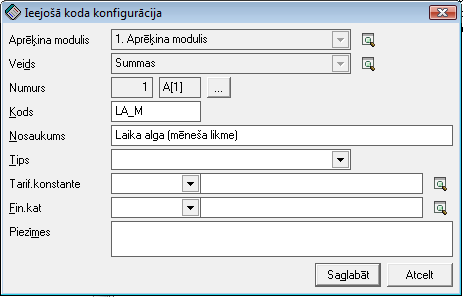

.. 282
 
Ieejošo kodu konfigurācija
******************************
 

Ieejošo kodu konfigurācijā tiek nodefinēti uzņēmumā izmantotie algu
aprēķina ieejošie kodi, kas tiek izmantoti veidojot algu aprēķina
algoritmu :doc:`Rezultējošo kodu konfigurācijā<283>` .Ieejošajos kodos
tiek nodefinēti visi nepieciešamie algu aprēķināšanai izmantotie
parametri - summas (alga, piemaksas, utt.), darba dienas (nostrādātās,
atvaļinājuma, utt.), kalendārās dienas (kavētās kalendārās dienas,
utt.), procenti, utt..

|images_ozols/26351.png|

Aprēķina modulis - jānodefinē algu aprēķina modulis no :doc:`Aprēķinu
moduļu saraksta<213>` .

Veids - jānodefinē ieejošā algu koda veids no :doc:`Ieejošo kodu veidu
saraksta<279>` .

Numurs - jānodefinē ieejošā koda numurs. Norādot Koda veidu šajā laukā
tiek aizpildīts norādītajam koda veidam nākošais brīvais numurs. Koda
numurs ir unikāls viena veida ietvaros.

Kods - jānodefinē kods.

Nosaukums - jānodefinē nosaukums.

Tips - iespēja nodefinēt tipu.

Tarif.konstante - iespēja nodefinēt :doc:`Algu tarifikācijas
konstanti<281>` .

Dimensijas - iespēja nodefinēt dimensijas. Ja uzņēmumā tiek izmantota
daudzdimensiju uzskaite, tad šajos laukos ir iespēja ieejošajam kodam
nodefinēt šim kodam atbilstošās dimensijas. Ja ieejošajam kodam var
būt vairākas dimensijas, tad šie lauki nav jāaizpilda un dimensijas
jāpievieno :doc:`Algu tarifikācijā<728>` vai :doc:`Algu aprēķinā<212>`
. Ja ieejošajam kodam nav jānorāda dimensijas, tad šajos laukos ir
jāaizpilda vērtība [KIVFA].

Piezīmes - iespēja norādīt piezīmes.

Ieejošie kodi nosaka, kādas vērtības tiks izmantotas, lai iegūtu algu
aprēķina rezultātus, ieejošie kodi var būt alga, piemaksas, prēmijas,
samaksa par stundu darbu, nakts stundām, virsstundām u.tml.. Tāpat ar
ieejošajiem kodiem ir jāfiksē kavētās darba dienas, atvaļinājuma
dienas, slimības dienas. Kā ieejošos kodus var izmantot jebkuru
informāciju, kas nepieciešama, lai aprēķinātu algu rezultātus,
piemēram, dažādas likmes, tarifus, koeficientus. Ieejošo kodu veidus
nosaka izveidotie maksājumu veidi (>Pārlūks > Alga > Konfigurācija >
:doc:`Ieejošo kodu veidi<279>` ).

Pievienojot jaunus ieejošos maksājumus, jānorāda aprēķina modulis un
ieejošā maksājuma veids. Numurs ir ieejošā koda kārtas numurs. Vienam
ieejošā maksājuma veidam nedrīkst būt divi ieejošie kodi ar vienādiem
numuriem, jo numurs tiek izmantots rezultātu aprēķinam (piemēram,
A[1], D[1] utt.). Laukā Kods jāpievieno saīsināts ieejošā koda
nosaukums. Jāpievieno ieejošā koda nosaukums.


 
