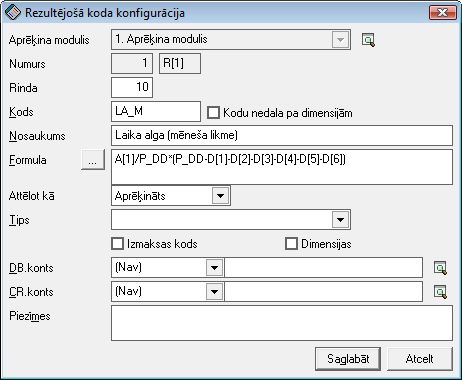

.. 283
 
Rezultējošo kodu konfigurācija
**********************************
 

Rezultējošo kodu konfigurēšana
++++++++++++++++++++++++++++++

Rezultējošo kodu konfigurācija nosaka algu aprēķina algoritma
pareizību. Ar sastādīto formulu palīdzību, ievadot algu aprēķinā
:doc:`Ieejošo kodu vērtības<282>` , tiek izrēķināt algu rezultāts –
aprēķināti nodokļi un noteikta summa izmaksai. Lai sakonfigurētu algu
rezultātus, jāveido rezultējošie kodi.

Rezultējošais kods ir vērtība, kura tiek aprēķināta atbilstoši
sastādītajai formulai. Formulu sastādīšanā tiek izmantoti ieejošo kodu
numuri. Formulās var iekļaut ieejošos kodus, sistēmā iebūvētās
vērtības, citus rezultātu numurus.

|images_ozols/26353.png|

Pievienojot rezultējošo kodu, jānorāda aprēķina modulis.
Rezultējošajam kodam tiek piešķirts pirmais brīvais numurs. Lai
pārnestu uz algu aprēķina rezultātiem ieejošos kodus, laukā Formula
jāraksta atbilstošo mainīgā nosaukumu, piemēram, A[1] - LA_M (laika
alga mēneša likme). Vairāku mainīgo summai izmanto saskaitīšanas zīmi,
piemēram, A[1]+A[2]+A[3]. Tāpat var izmantot citas elementārās
matemātikas operācijas, piemēram, A[1]/P_DD*(P_DD-D[1]), kur P_DD ir
perioda darba dienu skaits, bet D[1] ir kavēto darba dienu skaits. Ar
šādas formulas palīdzību tiek realizēta situācija, ka algas aprēķina
laikā pievienojot kavētās darba dienas, rezultātos tiek attiecīgi
samazināta aprēķinātās algas summa.
Aprēķina formulās var arī izmantot jau iepriekš iegūtos rezultātus,
tikai jāievēro, lai tie būtu izrēķināti iepriekš.

|images_ozols/24545.gif| Aprēķina formulā jāizmanto tikai iepriekš
aprēķinātie rezultāti. Rezultējošo kodu aprēķina secību norāda
rezultējošo kodu vērtība „Rinda”.

Katrs algu aprēķina rezultāts, kas jāparāda algu lapiņā vai
kopsavilkumā, ir jānoformē kā atsevišķs rezultējošais ieraksts. Pēc
tam vairākus rezultējošos kodus var grupēt starpsummās.
Rezultējošos ierakstus var neuzrādīt algu aprēķina rezultātos,
piemēram, starpsummas, ja rezultējošo datu konfigurācijā laukā
“Attēlot kā” ir iestādīta vērtība “Nerādīt”. Rezultējošajiem
ierakstiem, kas sastāda aprēķināto algu, lauks “Attēlot kā:” ir
jānorāda kā “Aprēķināts”. Savukārt visiem ieturējumiem (nodokļiem un
ieturējumiem) ir jānorāda “Ieturēts”.
Ja rezultāts ir izmaksa, tad laukā Izmaksāt jānorāda, kurš izmaksu
saraksta veids tiks izmantots. Izmaksu saraksta veidiem jābūt iepriekš
izveidotiem (>Saraksti > Alga > :doc:`Izmaksu sarakstu veidi<280>` ).

Algu aprēķina formulu sastādīšanas secība
+++++++++++++++++++++++++++++++++++++++++

Formulu sastādīšanā būtu jāievēro zināma secība, jo vispirms iegūtie
rezultāti jāizmanto citu formulu sastādīšanā. Optimālā secība, kuru
ieteicams ievērot, sastādot algu aprēķina formulas:
- Rezultāti, kas tiek aplikti ar visiem nodokļiem;
- Ar sociālo nodokli apliekamās starpsummas;
- Sociālais nodoklis darba ņēmējam;
- Maksājumi, kas netiek aplikti ar sociālo nodokli vai/un ienākuma
nodokli;
- Ar ienākuma nodokli apliekamā summa;
- Ienākuma nodoklis;
- Citi ieturējumi;
- Izmaksas.

Vispirms tiek summēti visi maksājumi, kas tiek aplikti ar visiem
nodokļiem un izveidota starpsumma sociālā nodokļa aprēķināšanai. Tad
tiek aprēķināts sociālais nodoklis darba ņēmējam. Ja uzņēmumā ir
maksājumi, kuri netiek aplikti ar sociālo nodokli, bet tiek aplikti ar
ienākuma nodokli, tad tālāk jāveic šo maksājumu aprēķins. Visi
iepriekšminētie maksājumi tiek summēti ar ienākuma nodokli apliekamajā
starpsummā (bruto), kura tiek izmantota ienākuma nodokļa aprēķināšanā.
Tiek veikts ienākuma nodokļa aprēķins. Pēc tam tiek sagatavoti pārējie
ieturējumi.

Rezultējošo kodu konfigurēšana algu grāmatojumu izveidei
++++++++++++++++++++++++++++++++++++++++++++++++++++++++

Lai varētu izveidot algu grāmatojumu pirmdokumentu, rezultējošo kodu
konfigurācijā algu aprēķina rezultātu kodiem nepieciešams norādīt
debeta un kredīta kontus.

Ar komandpogas Atvērt(Alt+A) palīdzību jāatver nepieciešamā
rezultējošā koda konfigurācija un jāpievieno DB.konts un CR.konts.

|images_ozols/24545.gif| Instrukcija: :doc:`Grāmatvedisko kontu
piesaistīšana algu rezultējošiem kodiem<14109>`

.. |images_ozols/24545.gif| image:: images_ozols/24545.gif
       :scale: 100%

.. |images_ozols/24545.gif| image:: images_ozols/24545.gif
       :scale: 100%


 
