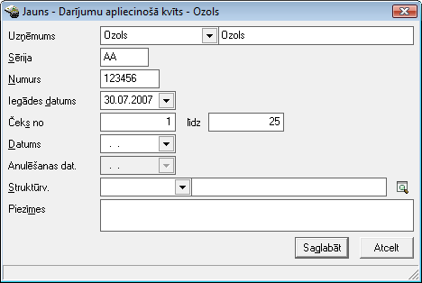
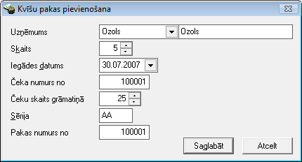
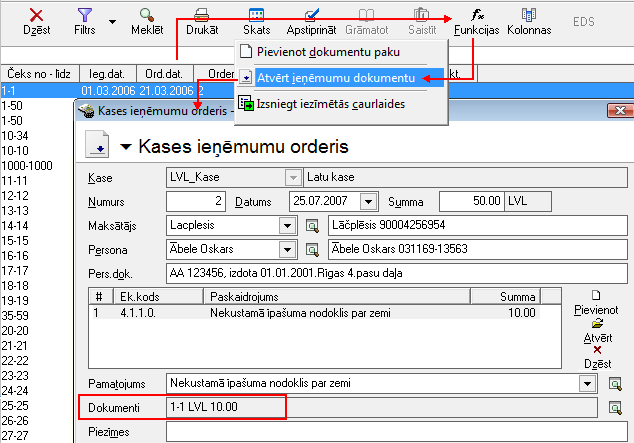

.. 286
 
Darījumu apliecinošo kvīšu žurnāls
**************************************
 


Lai uzskaitītudarījumu apliecinošo kvīšuizlietojumu, Uzņēmuma rīcībā
esošostingrās uzskaites kvīšunumuri jāpievienoDarījumu apliecinošo
kvīšužurnālā.


Darījumu apliecinošo kvīšu grāmatiņas pievienošana datu bāzei
`````````````````````````````````````````````````````````````

Darījumu apliecinošo kvīšu grāmatiņupievienošana, izmantojot rīku
joslas komandpogu "Pievienot" un aizpildot darījumu apliecinošo kvīšu
grāmatiņasapraksta ekrāna formu, nodrošina vienasdarījumu apliecinošo
kvīšu grāmatiņaspievienošanu datu bāzē. AtrodotiesDarījumu apliecinošo
kvīšužurnālā, rīku joslā nospiežot komandpogu |images_ozols/24708.png|
, tiks atvērta darījumu apliecinošās kvīts ekrāna forma:


|images_ozols/25011.png|


Sērija - jānorādakvīšu grāmatiņassērijas numurs.

Numurs - jāievada kvīšu grāmatiņas numurs.

Iegādes datums - jānorādakvīšu grāmatiņasiegādes datums.

Čeks no...līdz - jānorāda kvīšu grāmatiņā esošo čeku numuri no - līdz.

Datums -kvīšu grāmatiņasizsniegšanas datums.

Anulēšanas dat. - laukā automātiski tiks iefiksēts anulēšanas datums,
anulējot stingrās uzskaites kvīti.

Struktūrvienība - iespēja norādīt struktūrvienību, kura šo kvīšu
grāmatiņu pieņem uzskaitē.


Darījumu apliecinošo kvīšužurnālā pieejamās funkcijas
`````````````````````````````````````````````````````

Darījumu apliecinošo kvīšu žurnālā ir izveidotas funkcijas:


|images_ozols/24983.png|


1)Kvīšu grāmatiņupakas pievienošanas funkcija;
2) Naudas ieņēmumu dokumenta atvēršana, kuram piesaistīta kvīšu
grāmatiņa;


1) Pievienot dokumentu paku
+++++++++++++++++++++++++++


Uzņēmuma rīcībā esošās kvīšu grāmatiņas jāpievienoDarījumu apliecinošo
kvīšužurnālā.Kvīšu grāmatiņupakas pievienošanai, nepieciešams
izvēlētiesfunkciju |images_ozols/25007.png| , kasnodrošina
vairākuKvīšu grāmatiņuvienlaicīgu pievienošanu datu bāzē. Norādot
grāmatiņu skaitu unKvīšu grāmatiņusākuma numuru, tiek automātiski
uzģenerēts norādītais skaits darījumu apliecinošo kvīšu grāmatiņu:


|images_ozols/25012.png|


Skaits - jānorādaskaits, cik kvīšu grāmatiņasnepieciešams pievienot.

Iegādes datums - nepieciešams norādītdarījumu apliecinošo kvīšu
grāmatiņu iegādes datumu.

Čeka numurs no - jānorāda pirmais čeka numurs, no kura tiksturpināta
pārējo čeku secīga numerācija pēc kārtas.

Čeku skaits grāmatiņā -nepieciešams norādīt attiecīgočeku skaitu vienā
kvīšugrāmatiņā.

Sērija - jāievada darījumu apliecinošās kvīšu grāmatiņas sērija.

Pakas numurs no - iespēja norādīt pakas numuru, no kuras tiks
turpināta pārējo grāmatiņu secīga numerācija pēc kārtas.


Pēc visu nepieciešamo lauku aizpildīšanasnospiežot pogu
|images_ozols/24615.jpg| -dokuments tiks saglabāts un būs pieejams
apskatei/labošanai :doc:`Darījumu apliecinošo kvīšu žurnālā<286>` .

Nospiežot pogu |images_ozols/24875.png| , darbība tiks atcelta unkvīšu
grāmatiņasnetiks pievienotas datu bāzei.


2) Atvērt ieņēmumu dokumentu
++++++++++++++++++++++++++++

Izvēloties Darījumu apliecinošo kvīšu žurnālāpieejamo funkciju
|images_ozols/25008.png| , iespēja atvērt Ieņēmumu dokumentu -
:doc:`Kases ieņēmumu orderi<350>` , kuram izvēlētāKvīšu grāmatiņair
piesaistīta:


|images_ozols/25013.png|


Pievienoto darījumu apliecinošo kvīšu grāmatiņulabošana
```````````````````````````````````````````````````````

Labojumus saglabātajādokumentā iespējams veikt atverotKvīšu
grāmatiņasaprakstu, kurš pieejams apskatei/labošanai :doc:`Darījumu
apliecinošo kvīšu žurnālā<286>` . Lai labotu pievienoto kvīšu
grāmatiņu, Darījumu apliecinošo kvīšu žurnālā jāizmanto komandpoga
|images_ozols/24709.png| (ALT+A), unatvērtajāierakstā iespējams
veiktnepieciešamos labojumuskvīšu grāmatiņasapraksta ekrāna formā.

Pēc labojumu veikšanas, veiktā izmaiņas iespējams
|images_ozols/24615.jpg| vai |images_ozols/24617.jpg| .


Darījumu apliecinošās kvīšu žurnālā pievieontās Kvīšu
grāmatiņasiespējams piesaistīt :doc:`Kases ieņēmumu orderim<350>` .


.. |images_ozols/24708.png| image:: images_ozols/24708.png
       :scale: 100%



.. |images_ozols/24983.png| image:: images_ozols/24983.png
       :scale: 100%

.. |images_ozols/25007.png| image:: images_ozols/25007.png
       :scale: 100%




.. |images_ozols/24875.png| image:: images_ozols/24875.png
       :scale: 100%

.. |images_ozols/25008.png| image:: images_ozols/25008.png
       :scale: 100%



.. |images_ozols/24709.png| image:: images_ozols/24709.png
       :scale: 100%


.. |images_ozols/24617.jpg| image:: images_ozols/24617.jpg
       :scale: 100%


 
